# 周期截断下导电介质网络的几何判定、概率夹逼与成本优化

## 摘要

本文研究周期立方微构体中导电介质的左右导通判定、随机填充概率界与成本优化问题。针对附件给出的确定性构型，将每个平端圆柱视为图节点，以介质间最短距离和介质—电极距离为连边准则；胶囊体仅用于生成保守候选边，正例路径再由轴段内部最短点完成几何核验。随机填充部分首先声明独立均匀中心、独立各向同性取向以及周期平移片段保持母体导体身份三项概率模型条件；随后由单粒子直接贯通事件构造总导通概率下界，并对“无直接贯通但仍存在通路”的剩余事件建立终端薄壳联合上界。最后在整数域内枚举全部低成本方案，分别讨论允许某类介质为零和两类介质均为正两种口径。

在上述概率模型条件下，附件组1不导通，组2和组3导通，显式通路分别为左面-2-12-24-39-右面和左面-63-264-216-351-右面。A 的体积分数为0.50%、0.60%、0.70%和1.00%时，仅直接贯通事件已使总不导通概率上界分别降至10^-45.20、10^-54.13、10^-63.20和10^-90.27量级；这些下界严格小于1，不能因浮点舍入写成精确等于1。仅填充A时，7根A的总导通概率上界为0.872279，8根A的直接贯通概率下界为0.904810，故最低数量为8根，对应体积分数0.01131%，按百分号后两位报告为0.01%。

混合填充中，按题目“同时填充”的严格语义，1A+50B为两类数量均为正时的最低成本方案，成本0.09862元；放宽为非负整数域后，边界解0A+57B成本0.09550元。全文区分解析事件概率、总导通下界和总导通上界，阈值与最优性均由不可行侧的上界证据闭合。

**关键词：** 周期边界；随机几何图；导通概率界；联合界；整数优化

## 1  问题重述与问题分析

### 1.1  问题背景与研究对象

题目给定边长L=10000 nm的立方微构体，左右带电面位于x=-5000 nm与x=5000 nm。当导电介质之间或介质与带电面的表面最短距离不超过g=1.8 nm时，视为接触导通。介质A为高度H=5000 nm、半径r_A=30 nm的平端直圆柱；介质B为半径r_B=200 nm的球。题面规定越界部分平移一个边长后从对侧进入。随机问题还需要补充解释：本文把这些平移片段视为母体导体的周期表示，电学身份保持不变。该解释是Q2-Q4解析结论成立的条件，图1概括几何对象和接触口径。

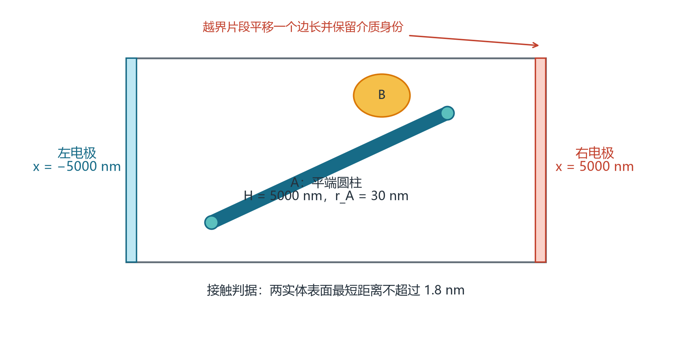

图1  问题几何、介质类型与周期边界示意

### 1.2  四个问题的输入、输出与难点

问题一的输入是附件中的三组圆柱轴段坐标，输出是每组是否导通及可复核的通路；难点在于平端圆柱不能直接等同于端部为半球的胶囊体。问题二将确定性坐标改为随机位置和随机方向，要求计算四个体积分数下的导通概率。问题三寻找仅填充A且导通概率不低于90%的最低填充率，需要同时证明候选值充分和前一整数不足。问题四加入B及材料成本，形成带概率约束的二元整数优化，并存在“是否允许某类介质数量为零”的题意歧义。

### 1.3  总体技术路线

本文把四问组织为三个层次：第一层为确定性几何图和路径证书；第二层为所有随机问题共享的直接贯通下界与非直接通路上界；第三层为基于概率界的整数阈值和成本优化。该结构使Q2-Q4共享同一母模型，避免每问重复定义概率口径。技术路线如图2所示。

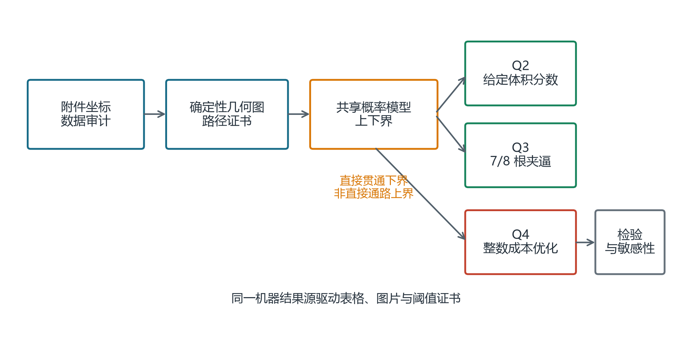

图2  四问依赖关系与总体技术路线

### 1.4  基线方法与模型选择

最直接的基线是逐次随机生成全部介质、构造几何接触图，再以蒙特卡洛频率估计导通概率。这一方法适合估计一般构型的真实总导通概率，但阈值附近若要区分7根不足与8根充分，有限样本频率只能给统计区间，不能自动给出整数最小性的证明；问题四还需要对大量整数配方重复模拟。本文因此保留确定性几何图作为问题一的执行层，在问题二至四使用解析上下界作为主证明。解析界不是对全几何仿真的替代品，而是为阈值和全局最优性提供可核验的不可行证书。

**表1  候选建模路线及本文取舍**

| 路线 | 可回答内容 | 主要不足 | 本文用途 |
| --- | --- | --- | --- |
| 逐样本几何图+蒙特卡洛 | 真实总导通概率的区间估计 | 需通用周期平端实体距离核；阈值证明成本高 | 未来校准 |
| 连续渗流阈值 | 大体系的簇形成与长径比效应 | 与有限盒、电极和单粒子跨界规则不等价 | 机制对照 |
| 直接贯通解析下界 | 候选方案的严格可行性 | 不计多粒子曲折通路 | Q2、Q3、Q4充分性 |
| 终端薄壳联合上界 | 低填充方案的严格不足性 | 通常偏松，不估计真实概率 | Q3、Q4排除证书 |

## 2  模型假设、符号与量纲

### 2.1  题面条件与补充假设

**表2  题面条件、补充假设及失效影响**

| 类别 | 内容 | 使用位置 | 改变后的影响 |
| --- | --- | --- | --- |
| 题面条件 | 每行附件数据表示一个A；边界越界部分周期平移 | Q1-Q4 | 改变介质身份或周期解释会改变全部结果 |
| 几何口径 | Q1按附件每行一个A建图；不跨行合并介质身份 | Q1 | 跨行合并会制造同体边 |
| 补充假设 | 介质中心独立且在立方体内均匀分布 | Q2-Q4 | 排斥或团聚会破坏独立乘积式 |
| 补充假设 | A的轴向独立且各向同性 | Q2-Q4 | 取向偏置会改变q_A及整数阈值 |
| 题面条件 | 随机介质允许相互贯穿、重叠 | Q2-Q4 | 若增加排斥约束则概率模型改变 |
| 补充解释 | 周期平移片段保持母体导体的电学身份 | Q2-Q4 | 若片段电学断开，则直接贯通机制失效 |

### 2.2  主要符号

**表3  主要符号及含义**

| 符号 | 含义 | 取值或单位 |
| --- | --- | --- |
| L | 立方体边长 | 10000 nm |
| g | 表面导通阈值 | 1.8 nm |
| H, r_A | 介质A的高度与半径 | 5000 nm, 30 nm |
| r_B | 介质B半径 | 200 nm |
| n_A, n_B | A、B填充数量 | 非负整数 |
| a_x | 粒子在x方向的支撑半宽 | nm |
| D | 至少一个粒子直接贯通事件 | 事件 |
| T | 整体左右导通事件 | 事件 |
| S_i^L, S_i^R | 粒子i未越界但接触左/右电极的剩余薄壳事件 | 事件 |
| P_dir | 直接贯通事件D的概率 | [0,1] |
| C | 材料成本 | 元 |

### 2.3  体积与成本换算

$$ V_A=πr_A²H=1.4137167×10⁷ nm³,   V_B=4πr_B³/3=3.3510322×10⁷ nm³ \tag{1} $$

$$ C=1.05V_An_A/10⁹+0.05V_Bn_B/10⁹=0.0148440253n_A+0.0016755161n_B \tag{2} $$

式(1)按真实圆柱与球体积计算，式(2)把nm^3换算为um^3。所有数量先在整数域内求解，体积分数仅作为结果的物理表达，不用四舍五入后的体积分数反推粒子数。

## 3  问题一：确定性构型的几何连通模型

### 3.1  附件数据审计

三组附件分别包含12、49和535行介质A数据。轴段长度范围为1019.117-5000.000 nm、577.474-5000.000 nm和525.697-5000.000 nm，说明坐标中保留了边界截断后的轴段表达。组1、组2和组3触及任一边界面的行比例分别为58.3%、44.9%和71.0%。附件又明确每行表示一个A，因此本文不因相对边界端点重合而跨行合并身份，也不把短轴段擅自延长。数据特征见图3。

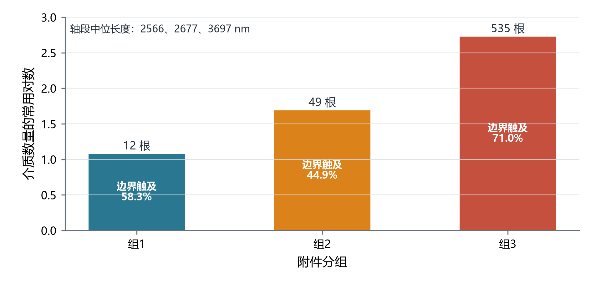

图3  附件三组数据规模与边界截断特征

附件中还存在坐标数值相同或相差固定量的端点，但题面只提供每行两端坐标，没有原始中心、原始方向和周期片段ID。仅凭端点巧合无法唯一判定两行是否来自同一母体；特别是±500并不是边长10000 nm正方体的边界，不能据此合并。为保证结果可重现，主口径采用题面附件说明的行级身份。若未来取得片段ID，应把同一母体的所有片段并入一个图节点，并重新计算与电极及其他介质的最短距离；当前结论明确限定在可识别的行级轴段口径。

### 3.2  行级连通图

建立无向图G=(V,E)。V由两个虚拟电极节点LEFT、RIGHT和每一行对应的圆柱节点组成。若圆柱与电极的最短距离不超过g，则连接圆柱节点与相应电极；若两个圆柱的表面最短距离不超过g，则连接对应节点。LEFT与RIGHT位于同一连通分量当且仅当该构型导通。

$$ (i,j)∈E ⇔ dist(A_i,A_j)≤g;   (LEFT,i)∈E ⇔ dist(A_i,F_L)≤g \tag{3} $$

实现时先由轴段采样点的KD树生成保守候选对，再对候选轴段使用闭式最短距离核复核；附件规模最大仅535行，另以全对全O(n²)枚举作为独立对照。电极接触不只检查端点x坐标，还将圆柱端面圆盘在x方向的径向投影计入支撑范围。最后用广度优先搜索判定连通，并由父指针恢复一条显式LEFT—RIGHT路径。

```python
输入：每行轴段端点 P_i,Q_i
1. 计算每根圆柱对左右电极的表面间隙
2. KD 广相位生成候选对；精确轴段距离筛选胶囊超图边
3. 将 LEFT、RIGHT 与接触圆柱连边
4. BFS 搜索 LEFT 到 RIGHT；若成功则回溯路径
5. 对路径每条圆柱边计算 s、t、端面余量与正交残差
输出：连通布尔值、显式路径、逐边证书
```

KD广相位的作用只是减少需要精算的候选数，不能改变最终判定；全对全对照用于防止采样间距造成漏边。BFS复杂度为O(|V|+|E|)，最耗时部分是候选边距离核。所有比较均保留1e-10 nm级数值容差，容差只吸收浮点舍入，不扩大题设1.8 nm阈值。

### 3.3  平端圆柱的候选边与充分证书

两条轴段的最短距离不超过2r_A+g=61.8 nm时，相应胶囊体必接触，因此该条件可用于生成候选边。但胶囊体把圆柱端部替换为半球，可能把端点附近接近误判为平端圆柱接触。为避免这一问题，对正例路径中的每条圆柱—圆柱边保存轴段最短点参数s,t。当0<s<1且0<t<1时，两个最短点均位于轴段内部，表面间隙等于max(0,d_axis-2r_A)，可作为真实侧面接触的充分证书。对负例，胶囊体是平端圆柱的超集；若胶囊超图仍不连通，则真实图一定不连通。图4解释了证书条件。

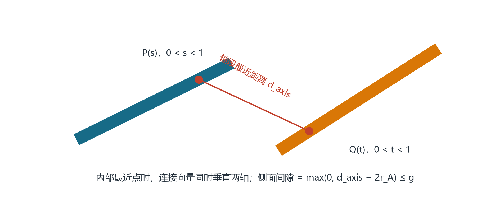

图4  平端圆柱侧面接触的轴段最短点证书

更具体地，设两轴段参数式为P(s)=P_0+s(P_1-P_0)、Q(t)=Q_0+t(Q_1-Q_0)。内部极小点满足连接向量P(s)-Q(t)同时垂直于两轴方向，因此沿该连接向量分别向两条轴外移r_A后，仍落在对应截面圆盘内，实体表面间隙恰为d_axis-2r_A。正文同时保存端面余量min{sL_i,(1-s)L_i,tL_j,(1-t)L_j}；其为正说明接触截面不落在端面退化区。正交残差则用于排查数值求解是否真的满足内部驻点条件。

若s或t落在0、1附近，轴段距离减半径只能给胶囊体候选，真实平端圆柱可能属于侧面—端面、端面—端面或圆周—侧面情形，本文不把这类边直接当作正例证书。该不对称策略保证：组1用超集不连通证明负例不会误判；组2、组3只选取通过内部侧面条件的路径证明正例，也不会依赖未经认证的端部候选边。

### 3.4  三组构型的求解结果

对每组数据先计算电极接触，再全对全生成候选边，以广相位空间索引复核边数，最后用广度优先搜索恢复LEFT-RIGHT路径。图5把三组真实xyz构型并列展示，红线只标注算法恢复的路径；三维图用于解释空间关系，结论仍以数值图搜索和路径证书为准。

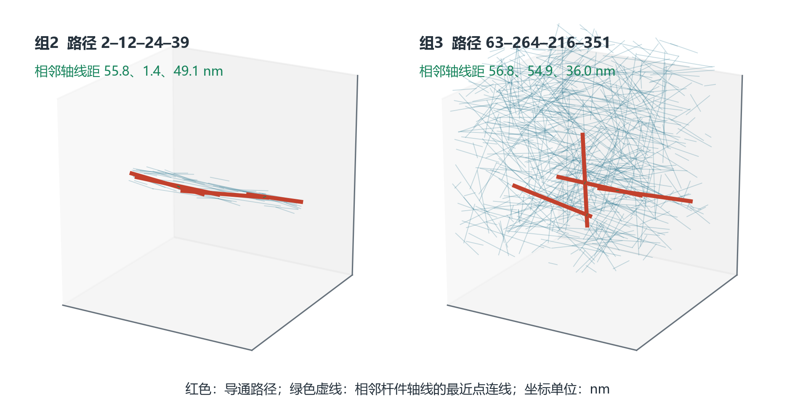

图5  组2与组3的三维导通路径及相邻杆件最近点证书

**表4  Q1三组附件构型的连通结果**

| 组别 | 节点数 | 边数 | 左接触 | 右接触 | 结论 | 显式路径 |
| --- | --- | --- | --- | --- | --- | --- |
| 组1 | 12 | 2 | 3 | 4 | 不导通 | 无 |
| 组2 | 49 | 27 | 11 | 11 | 导通 | 左面-2-12-24-39-右面 |
| 组3 | 535 | 166 | 92 | 90 | 导通 | 左面-63-264-216-351-右面 |

组1在更易连通的胶囊超图中仅有2条介质间候选边，LEFT与RIGHT仍分属不同连通分量，因此按附件行级口径不导通；由于真实平端圆柱图是该超图的子图，这一负结论不依赖端部距离分类。组2和组3均找到显式路径。逐边证书表不仅列出6条介质间边的s、t、端面余量和正交残差，也列出两条路径各自的LEFT首边与末边RIGHT电极表面间隙，从而覆盖完整路径而不是只检查中间杆件。

**表5  Q1正例完整路径的逐边证书**

| 组别 | 边 | 距离/nm | s | t | 端面余量/nm | 正交残差 | 结论 |
| --- | --- | --- | --- | --- | --- | --- | --- |
| 组2 | LEFT-2 | 0.000 | — | — | — | — | 电极接触通过 |
| 组2 | 2-12 | 55.832 | 0.661 | 0.522 | 1436.0 | 3.4e-14 | 通过 |
| 组2 | 12-24 | 1.441 | 0.919 | 0.346 | 403.9 | 4.9e-12 | 通过 |
| 组2 | 24-39 | 49.073 | 0.970 | 0.310 | 147.8 | 2.6e-12 | 通过 |
| 组2 | 39-RIGHT | 0.000 | — | — | — | — | 电极接触通过 |
| 组3 | LEFT-63 | 0.000 | — | — | — | — | 电极接触通过 |
| 组3 | 63-264 | 56.765 | 0.962 | 0.882 | 192.0 | 9.1e-15 | 通过 |
| 组3 | 264-216 | 54.914 | 0.535 | 0.324 | 1617.6 | 1.3e-15 | 通过 |
| 组3 | 216-351 | 36.028 | 0.722 | 0.199 | 981.8 | 2.9e-13 | 通过 |
| 组3 | 351-RIGHT | 0.000 | — | — | — | — | 电极接触通过 |

## 4  Q2-Q4共享的随机填充概率模型

### 4.1  单粒子直接贯通事件

若某粒子在x方向跨越任一周期边界，其越界片段从对侧进入且保持同一导体身份，于是该粒子自身形成左右贯通。该事件是总导通事件T的充分条件而非必要条件，因此由它得到的是严格概率下界。图7分别示意圆柱A和球B的直接贯通机制。

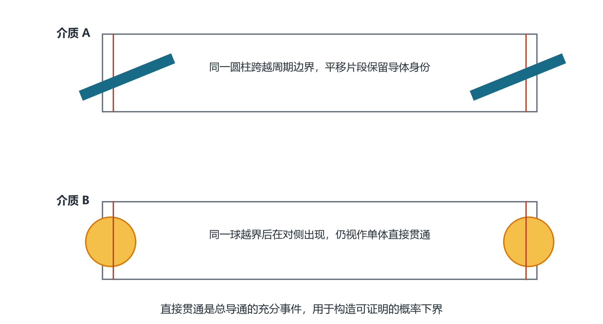

图6  A、B单粒子跨越周期边界的直接贯通机制

### 4.2  圆柱A的直接贯通概率

设圆柱轴向单位向量的x分量为u_x。平端圆柱在x方向的支撑半宽由轴向投影和端面圆盘投影共同组成。固定方向后，圆柱中心落入任一边界内侧a_x范围即越界，两侧合计条件概率为2a_x/L。

$$ a_x=(H/2)|u_x|+r_A√(1-u_x²) \tag{4} $$

圆柱轴是无向的，u与-u代表同一取向。各向同性轴向可在半球上取均匀面测度；等价地，U=|u_x|在[0,1]上服从均匀分布。因此两个期望可以直接化为一维积分：E|u_x|=∫_0^1u du=1/2，E√(1-u_x²)=∫_0^1√(1-u²)du=π/4。由于本题最大支撑半宽加阈值仍小于L/2，左右两条越界中心区间互不重叠，条件概率2a_x/L无需再截断。

将支撑半宽对取向积分即可得到单根A的直接贯通概率q_A。图中的曲线是固定取向条件概率，水平线是各向同性方向平均；二者不能混为一谈。

$$ q_A=2E(a_x)/L=(H/2+πr_A/2)/L=0.25471238898 \tag{5} $$

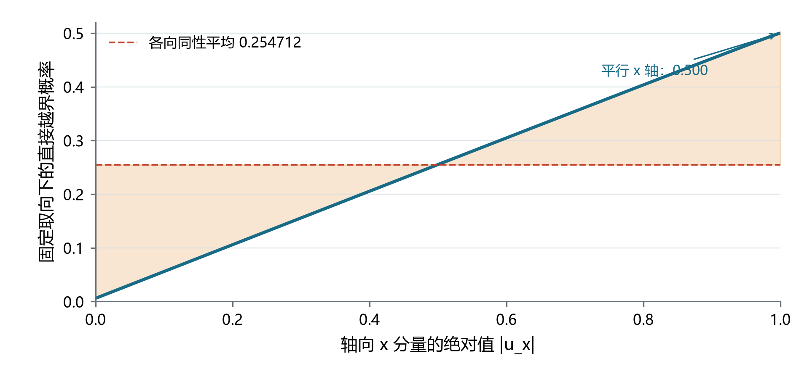

图7  圆柱取向对支撑半宽和条件越界概率的影响

### 4.3  球B与多粒子的直接贯通下界

球的支撑半宽恒为r_B，故球心落入任一边界内侧r_B范围即可越界。不同粒子的位置和方向独立时，至少一个粒子直接贯通的概率可由补事件乘积得到。

$$ q_B=2r_B/L=0.04 \tag{6} $$

$$ P_dir=P(D)=1-(1-q_A)ⁿᴬ(1-q_B)ⁿᴮ \tag{7} $$

### 4.4  非直接通路的剩余薄壳联合上界

为证明某个较低填充方案不可能达到90%，仅有下界不够。定义D_i为粒子i直接越界，C_i^L为粒子i接触左电极。固定其x向支撑半宽a_i时，无条件接触层宽为a_i+g，因此不能把P(C_i^L)误写成g/L。关键在于研究无直接贯通事件D^c中的剩余接触：粒子既不越界又接触左电极时，中心只能位于宽度恰为g的薄壳。

$$ S_iᴸ=C_iᴸ∩D_iᶜ={-L/2+a_i<X_i≤-L/2+a_i+g},   P(S_iᴸ)=g/L \tag{8} $$

令N=T交D^c。任何N中的左右路径都必须包含不同的终端粒子i和j，分别落入左、右剩余薄壳；若由同一粒子承担两端接触，则该粒子已经属于直接贯通事件D。对所有有序粒子对使用独立性和Boole联合界[3]，得到式(9)。事件关系见图9。

$$ P_dir≤P(T)≤min{1, P_dir+n(n-1)(g/L)²},   n=n_A+n_B \tag{9} $$

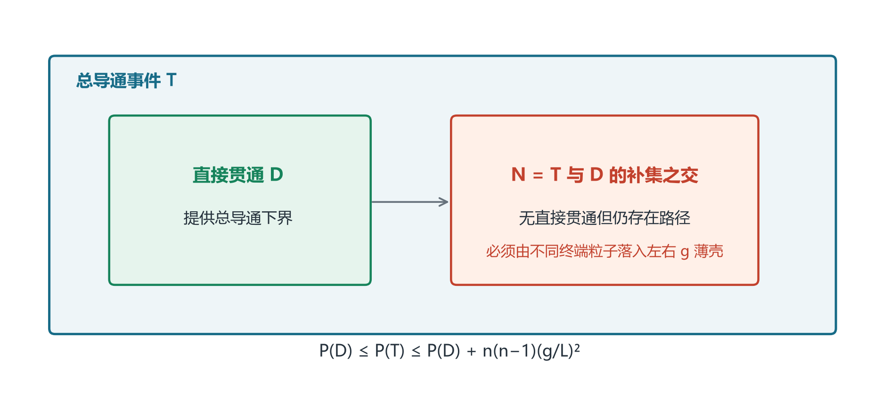

图8  总导通、直接贯通与剩余薄壳事件的上下界关系

式(9)可整理为一个终端薄壳上界命题。条件为：各粒子中心相互独立且x坐标均匀；单粒子支撑半宽加g小于L/2；周期越界片段保持同一介质身份。证明分四步：首先将总导通事件分解为D与N=T∩D的补集；其次，在N中任一左右通路都必须各有一个未越界的左、右终端；再次，同一未越界粒子因尺寸条件不可能同时承担两端，故终端是有序的不同粒子对；最后，对每一有序对使用跨粒子独立性得到(g/L)²，再对n(n−1)个有序对应用Boole联合界。中间链路被完全放宽为“一定存在”，所以该式宁可偏大也不会漏掉曲折通路。

上界增量看似与粒子形状无关，是因为支撑半宽a_i对应的越界区间已经被事件D剔除；剩余的电极接触层只比越界区间多出固定宽度g。若误把无条件电极接触概率写成g/L会低估终端事件，而本文只在D的补集内使用该薄壳宽度。

### 4.5  概率模型的解释边界

式(9)的上界用于证明“不足”，不用于精确估计真实导通概率；它忽略了中间粒子如何连接，因此通常偏松，但不会漏掉曲折通路。式(8)的下界用于证明“充分”，也不等于总导通概率。只有当上下界位于阈值两侧时，才能给出严格整数阈值或最优性结论。若粒子中心存在排斥、团聚或取向相关，式(8)中的独立乘积和式(9)中的跨粒子独立性需要重建。

### 4.6  与连续渗流模型的关系

随机杆体系常用排除体积、随机几何图或连续渗流阈值刻画大体系中多粒子簇的形成[5-10]。这些研究说明边概率会同时受到体积分数、形状、取向分布、接触壳和分散状态影响；对允许重叠的随机取向胶囊体，有限尺寸模拟也是成熟路线[10]。但胶囊体端部为半球，本题为平端圆柱；同时本题是有限立方体、指定左右电极，并采用特殊的周期截断规则，单粒子跨界事件已提供可计算的充分条件。因此本文不把热力学极限阈值移植为答案，只把它用作机制和量级的外部参照。若后续需要估计上下界之间的真实总概率，应先实现完整平端圆柱周期距离核，再做有限盒蒙特卡洛，而不能用平均邻居数替代。

## 5  问题二：给定体积分数下的导通概率

### 5.1  体积分数到整数数量的换算

设目标体积分数为phi。粒子数必须取整数，本文选择使n_A V_A/L^3最接近目标phi的整数n_A，并同时报告目标值与实际值。四个目标体积分数对应354、424、495和707根A。

$$ n_A=round(φL³/V_A),   φ_actual=n_AV_A/L³ \tag{10} $$

### 5.2  概率结果与解释

**表6  Q2体积分数、整数数量与直接贯通下界**

| 目标体积分数 | A数量 | 实际体积分数 | log10不导通上界 | 导通概率下界 |
| --- | --- | --- | --- | --- |
| 0.50% | 354 | 0.50046% | -45.20 | 至少1-10^-45.20 |
| 0.60% | 424 | 0.59942% | -54.13 | 至少1-10^-54.13 |
| 0.70% | 495 | 0.69979% | -63.20 | 至少1-10^-63.20 |
| 1.00% | 707 | 0.99950% | -90.27 | 至少1-10^-90.27 |

结果表中的“不导通上界”仅考虑没有任何A直接贯通的概率(1-q_A)^n_A。粒子间进一步接触只会增加总导通概率，因此该量确为总不导通概率的上界。四个数量级远低于常规数值显示精度，故可以表述为“在报告精度内导通概率为1”，但不能写成数学上精确等于1。随后图形展示其对数数量级。

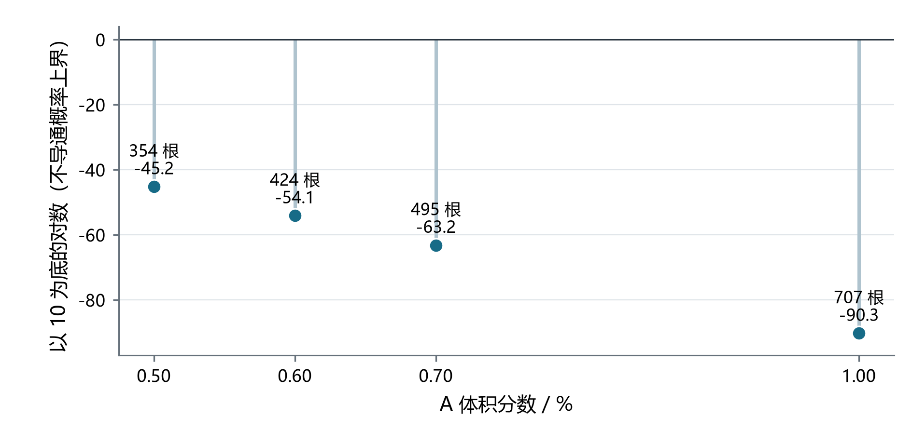

图9  Q2四种体积分数下不导通概率上界的数量级

### 5.3  数值稳定表达与概率区间

当n_A达到数百时，直接计算1-(1-q_A)^n_A会在双精度浮点中舍入为1，使“极接近1”和“严格等于1”无法区分。本文先计算log10 P(T的补集)≤n_A log10(1-q_A)，把失败概率的数量级作为机器结果保存；论文再写成P(T)∈[1-10^k,1]，其中k为表中负数。这样既保留数学上的严格性，也避免把浮点下溢当成物理必然。

四个工况的区间宽度从约10^-45降至10^-90。它们说明在本文概率生成机制下，单粒子跨界事件已经足以使失败风险极小；区间并不等于真实总导通概率的精确值，因为多粒子接触簇只会进一步抬高导通概率。若改变取向分布或取消周期身份，这些数量级必须重新计算，不能从体积分数单独外推。

## 6  问题三：仅填充A的最低填充量

### 6.1  候选阈值定位

由式(8)可知直接贯通下界随n_A单调增加。解1-(1-q_A)^n_A>=0.90可将候选值定位在8根。证明“8根是最小值”还需验证8根充分和7根不足。

$$ n_A≥⌈log(0.10)/log(1-q_A)⌉=8 \tag{11} $$

### 6.2  7根不足与8根充分

当n_A=8时，直接贯通概率下界为0.9048100243>0.90，故8根充分。当n_A=7时，直接贯通概率为0.8722775285；剩余非直接通路上界增量为7*6*(1.8/10000)^2=1.3608e-6，因而总导通概率上界为0.8722788893<0.90，故7根不足。图11显示上下界几乎重合但分别位于阈值两侧。

**表7  Q3从1至8根A的导通概率上下界**

| A数量 | 直接贯通下界 | 非直接上界增量 | 总导通上界 |
| --- | --- | --- | --- |
| 1 | 0.254712 | 0.00e+00 | 0.254712 |
| 2 | 0.444546 | 6.48e-08 | 0.444546 |
| 3 | 0.586027 | 1.94e-07 | 0.586027 |
| 4 | 0.691471 | 3.89e-07 | 0.691472 |
| 5 | 0.770057 | 6.48e-07 | 0.770058 |
| 6 | 0.828627 | 9.72e-07 | 0.828628 |
| 7 | 0.872278 | 1.36e-06 | 0.872279 |
| 8 | 0.904810 | 1.81e-06 | 0.904812 |

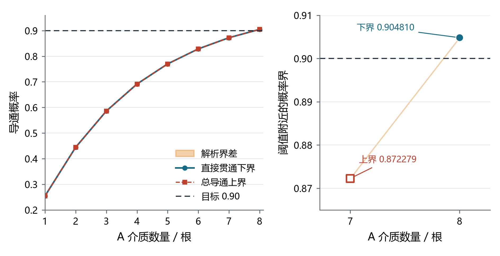

图10  Q3中7根不足、8根充分的解析夹逼

### 6.3  单调耦合与整数最小性

为说明只检查7和8两点即可闭合最小性，把n根和n+1根的随机构型耦合在同一概率空间：先生成前n根，再独立加入第n+1根。新增节点和接触边不会删除原有LEFT—RIGHT路径，因此真实总导通事件T_n包含于T_{n+1}，总导通概率关于粒子数单调不减。于是7根上界低于0.90可同时排除0至7根，8根下界高于0.90则证明8根可行。这个结论针对真实总导通事件，而不只针对解析下界。

### 6.4  填充率报告

8根A对应体积分数8V_A/L^3=0.0001130973，即0.01131%。若按百分号后保留两位，应报告0.01%；但必须同时保留“8根”和未过度舍入的0.01131%，因为相邻整数在两位百分数下可能显示相同。

## 7  问题四：混合填充的整数成本优化

### 7.1  优化模型

以n_A,n_B为整数决策变量，目标是最小化式(2)的材料成本，约束为总导通概率不低于0.90。由于总导通概率难以精确闭式计算，本文采用“候选方案用下界证明可行、所有更便宜方案用上界证明不可行”的双向证书。

$$ min C(n_A,n_B),   s.t. P(T)≥0.90,   n_A,n_B∈Z_≥0 \tag{12} $$

枚举域并非任意截取。只要先找到一个由直接贯通下界证明可行的候选(n_A*,n_B*)，其成本C*就是全局最优值的上界；任何更优解都必须满足c_A n_A+c_B n_B<C*，从而0≤n_A< C*/c_A、0≤n_B<C*/c_B，候选集合自动变为有限整数三角域。对其中每一点，若总导通上界仍小于0.90，则该点在未知真实概率下也必不可行。

```python
先由直接贯通下界寻找一个可行候选，记成本 C*
for n_A = 0,...,floor(C*/c_A):
    for n_B = 0,...,floor((C*−c_A n_A)/c_B):
        若成本 < C*：计算 P_upper(n_A,n_B)
        若 P_upper ≥ 0.90：保留为未排除候选
若未排除集合为空，则当前候选为全局最优
```

### 7.2  非负整数域的边界解

若允许某一类介质数量为零，0A+57B的直接贯通下界为0.9023976480，成本0.0955044元，故该方案可行。以该成本为上限，枚举全部216个更低成本非负整数点；其中总导通上界最大的是0A+56B，上界0.8984306753<0.90。因此所有更便宜方案均不可行，0A+57B在非负整数域严格最优。

### 7.3  两类介质均为正的主口径

题目中的“同时填充A、B”可能要求两类介质均出现。增加n_A>=1,n_B>=1后，1A+50B的直接贯通下界为0.9031977272，成本0.0986198元。枚举164个更低成本正混合点后，最危险方案1A+49B的总导通上界为0.8992436792<0.90。因此若按“同时填充”解释，应把1A+50B作为正式答案，0A+57B仅作为放宽约束后的对照。

**表8  Q4低成本前沿与两种口径的候选解**

| 方案 | 成本/元 | 直接下界 | 总上界 | 结论 |
| --- | --- | --- | --- | --- |
| 0A+56B | 0.093829 | 0.898331 | 0.898431 | 更便宜，不可行 |
| 1A+48B | 0.095269 | 0.894963 | 0.895039 | 更便宜，不可行 |
| 2A+39B | 0.095033 | 0.886962 | 0.887015 | 更便宜，不可行 |
| 3A+30B | 0.094798 | 0.878351 | 0.878385 | 更便宜，不可行 |
| 4A+21B | 0.094562 | 0.869084 | 0.869104 | 更便宜，不可行 |
| 5A+12B | 0.094326 | 0.859112 | 0.859121 | 更便宜，不可行 |
| 6A+3B | 0.094091 | 0.848380 | 0.848382 | 更便宜，不可行 |
| 0A+57B | 0.095504 | 0.902398 | - | 非负整数域最优 |
| 1A+50B | 0.098620 | 0.903198 | - | 正混合域最优 |

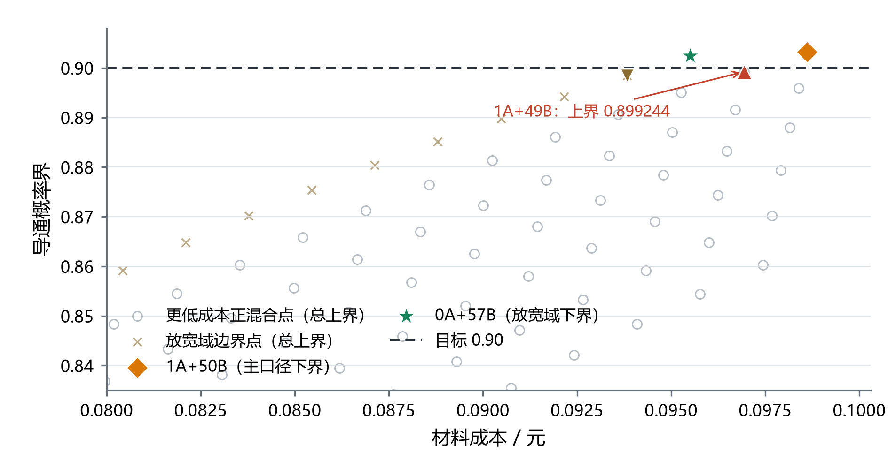

图11  Q4成本—概率界前沿与候选解证书

### 7.4  成本效率解释

A单体直接贯通概率高，但单体成本约为B的8.86倍；B虽需要更多数量，却具有更高的单位成本概率收益，因此非负整数域最优点落在纯B边界。强制两类均出现时，加入1根A可以减少7个B，形成1A+50B的正混合最优点。该解释只针对本题给定价格和尺寸，若B单价上升或半径改变，整数前沿会发生跳变。

以对数可靠性增益−log(1−q)除以单体成本作局部效率比较，B在当前价格下明显占优；但整数约束使替代关系不是连续比例，最优方案必须在离散格点上验证。1A+49B是主口径下最危险的更低成本点，其总上界仅比0.90低约7.56×10^-4，因此图形同时标出该点而不是只展示最优解。

## 8  模型检验、灵敏度与稳健性

### 8.1  几何算法检验

几何测试覆盖平行、相交、端点最近、轴段换序和多对批量计算等情形；对附件三组数据，全对全枚举与KD树广相位得到相同的连通结论和边数。正例路径逐边检查s,t、端面余量、轴距与正交残差，电极边另行保存表面间隙；负例则利用胶囊超集反证。当前测试共18项通过，其中概率边界测试明确区分无条件电极接触层a_i+g与非越界剩余薄壳g，防止把g/L误写成无条件接触概率。

**表9  计算与证据的验证矩阵**

| 对象 | 主计算 | 独立复核 | 通过标准 | 结果 |
| --- | --- | --- | --- | --- |
| 轴段最短距离 | 候选分段闭式核 | 换序、平行、相交与端点样例 | 距离对称且退化样例符合解析值 | 通过 |
| Q1候选边 | KD广相位+精算 | 全对全O(n²)枚举 | 三组边数与连通结论一致 | 通过 |
| 正例路径 | BFS父指针回溯 | 逐边几何证书 | 电极间隙≤g；内部边轴距≤61.8 nm | 通过 |
| Q3阈值 | 直接下界与薄壳上界 | 7、8根高精度重算 | 7根上界<0.90<8根下界 | 通过 |
| Q4最优性 | 成本以下整数枚举 | 记录最危险低价点 | 所有更低成本点上界<0.90 | 通过 |

### 8.2  概率与整数域复核

q_A由方向积分解析得到，q_B由球的边界层宽度直接得到；Q3分别重算7根上界与8根下界。Q4不是只比较表7中的前沿点，而是完整枚举成本严格低于候选的所有整数点，再取其总导通上界最大者。因此216和164是搜索域内实际候选数，不是抽样规模。

### 8.3  几何参数灵敏度

为考察结构敏感性，在保持其余条件不变的设计情景中令A高度H取3500-6500 nm、B半径r_B取120-280 nm。该范围不是实测误差或制造分布，只用于观察解析阈值的整数跳变。H增大时q_A线性增大，达到90%所需A数量呈阶梯下降；B半径增大时q_B=2r_B/L增大，所需B数量下降。题设基准H=5000 nm对应8根A，r_B=200 nm对应57个B。

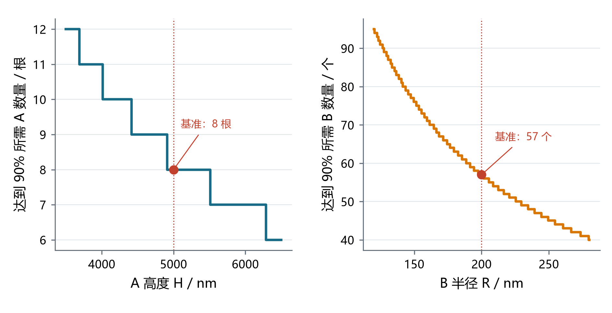

图12  设计情景下几何尺寸对90%充分数量的影响

### 8.4  假设敏感性与失效情形

**表10  关键假设变化对结论的影响**

| 变化 | 直接影响 | 最可能受影响的结论 | 建议改进 |
| --- | --- | --- | --- |
| A取向偏向x轴 | q_A增大 | Q3阈值下降，Q4更偏向A | 用实测取向分布替代各向同性积分 |
| 粒子不可重叠 | 位置不再独立 | Q2-Q4乘积式和联合界需重建 | 随机序列吸附或排斥点过程模拟 |
| 粒子团聚 | 局部连接增强但边界分布改变 | 总概率与解析界间隙增大 | 相关随机几何图与蒙特卡洛校准 |
| 周期片段不保持导体身份 | 直接贯通事件失效 | Q2-Q4全部数值失效 | 按新边界物理重新定义连接图 |
| 要求A、B均出现 | 可行域删去坐标轴 | Q4主答案变为1A+50B | 论文同时报告两种口径 |

### 8.5  取向分布极端情景

各向同性不是题面给定事实，而是把“任意方向”转化为概率的补充模型。若所有A都与x轴平行，则单根直接贯通概率q_A=H/L=0.500；若所有轴都限制在yz平面，则仅端面圆盘在x方向提供支撑，q_A=2r_A/L=0.006。二者相差两个数量级，说明取向分布会直接改变Q2的风险数量级以及Q3、Q4的整数阈值。故0.25471239应理解为各向同性方向平均，而非所有取向都成立的材料常数。

## 9  模型评价与改进

### 9.1  模型优点

第一，Q1采用路径证书而非只给程序布尔值，负例和正例分别由超集反证与侧面充分证书支撑。第二，Q2-Q4明确区分精确直接贯通概率、总导通下界和总导通上界，避免把蒙特卡洛频率或下界误当作真实概率。第三，Q4对候选成本以下的有限整数域完整枚举，最优性证据可逐点复算。第四，所有关键数值集中写入结构化结果文件并由测试检查，论文图表直接从附件和结果文件生成。

### 9.2  模型局限

随机模型的主要局限是题面未唯一指定概率测度，独立均匀、各向同性以及周期片段保持母体电学身份均需作为条件列明；允许重叠则来自题面。非直接通路联合上界只适合做不足性证明，不能精确刻画粒子间簇连通。Q1的路径核验只服务于所给附件结论，不代表候选图中的所有端部边都已完成通用平端圆柱实体距离分类。

### 9.3  后续改进

后续可在三方面扩展：其一，实现平端圆柱—圆柱、圆柱—球的完整最近距离求解器，替代胶囊候选超图；其二，引入不可重叠随机序列吸附、取向偏置或团聚点过程，并用方差缩减蒙特卡洛估计真实导通概率；其三，在解析界与模拟之间建立校准区间，使模型既能证明阈值，又能给出阈值以外更精细的工程概率估计。

## 10  结论

(1) 附件组1不导通，组2和组3导通；组2显式路径为左面-2-12-24-39-右面，组3为左面-63-264-216-351-右面。所有正例介质间边均具有轴段内部最短点证书。

(2) 在独立均匀中心、独立各向同性取向及周期片段保持母体电学身份的条件下，A体积分数0.50%、0.60%、0.70%和1.00%对应354、424、495和707根A；总不导通概率分别不超过10^-45.20、10^-54.13、10^-63.20和10^-90.27量级。

(3) 在同一概率模型条件下，仅填充A时，7根的总导通上界0.872279低于90%，8根的直接贯通下界0.904810高于90%，故最小数量为8根；体积分数为0.01131%，按百分号后两位报告为0.01%。

(4) 按“同时填充”要求A、B均出现时，主答案为1A+50B，成本0.09862元；若放宽为非负整数域，边界解为0A+57B，成本0.09550元。两者都受上述概率模型条件限制。

## 参考文献

[1] 华数杯大学生数学建模竞赛组委会，2026年第七届华数杯大学生数学建模竞赛A题：微构体中填充导电介质的仿真优化，2026。

[2] 华数杯大学生数学建模竞赛组委会，2026年华数杯数学建模竞赛论文格式规范与提交说明，https://m.saikr.com/chinamcm26，访问日期：2026-08-13。

[3] Feller W. An Introduction to Probability Theory and Its Applications, Vol. 1. New York: Wiley, 1968.

[4] Ericson C. Real-Time Collision Detection. Boca Raton: CRC Press, 2005.

[5] Meester R, Roy R. Continuum Percolation. Cambridge: Cambridge University Press, 1996.

[6] Balberg I, Anderson C H, Alexander S, et al. Excluded volume and its relation to the onset of percolation. Physical Review B, 1984, 30(7): 3933. DOI: 10.1103/PhysRevB.30.3933.

[7] Foygel M, Morris R D, Anez D, et al. Theoretical and computational studies of carbon nanotube composites and suspensions: Electrical and thermal conductivity. Physical Review B, 2005, 71: 104201. DOI: 10.1103/PhysRevB.71.104201.

[8] Otten R H J, van der Schoot P. Connectivity percolation of polydisperse anisotropic nanofillers. Journal of Chemical Physics, 2011, 134: 094902. DOI: 10.1063/1.3559004.

[9] Chatterjee A P, Grimaldi C. Random geometric graph description of connectedness percolation in rod systems[J]. Physical Review E, 2015, 92: 032121. DOI: 10.1103/PhysRevE.92.032121.

[10] Xu W, Su X, Jiao Y. Continuum percolation of congruent overlapping spherocylinders[J]. Physical Review E, 2016, 94: 032122. DOI: 10.1103/PhysRevE.94.032122.

[11] Schilling T, Miller M, van der Schoot P. Percolation in suspensions of hard nanoparticles: from spheres to needles[J]. Europhysics Letters, 2015, 111: 56004. DOI: 10.1209/0295-5075/111/56004.

## 附录A  复现环境与命令

复现环境：Python 3.13；numpy 2.2.6；pandas 3.0.3；openpyxl 3.1.5；scipy 1.16.3；pytest 9.1.0。

```python
cd mathmodel/runs/huashubei-2026-final-001
python -m pip install -r requirements.txt
python src/a/build_corrected_results.py
python src/a/build_research_figures.py
python src/a/build_full_paper.py
python -m pytest tests -q
```

当前A题几何与解析模型测试共18项通过；正文、图表和机器结果均可由上述命令重建。

## 附录B  证据文件索引

机器可读结果位于outputs/data/final_results.json；核心算法位于src/a/analytic_bounds.py、src/a/geometry.py和src/a/build_corrected_results.py；17组图形候选位于outputs/figure_candidates，12幅入文图的PNG、PDF与SVG源位于outputs/figures_research。为控制论文篇幅，完整源代码不再嵌入正文，而随仓库一并提交。
