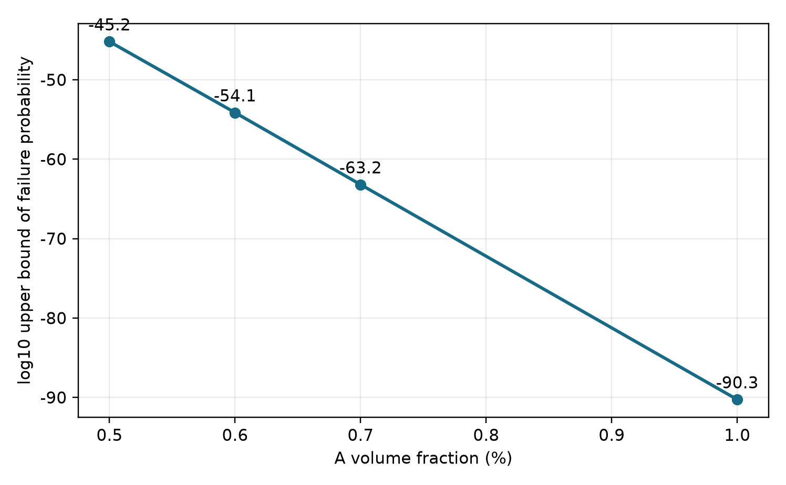
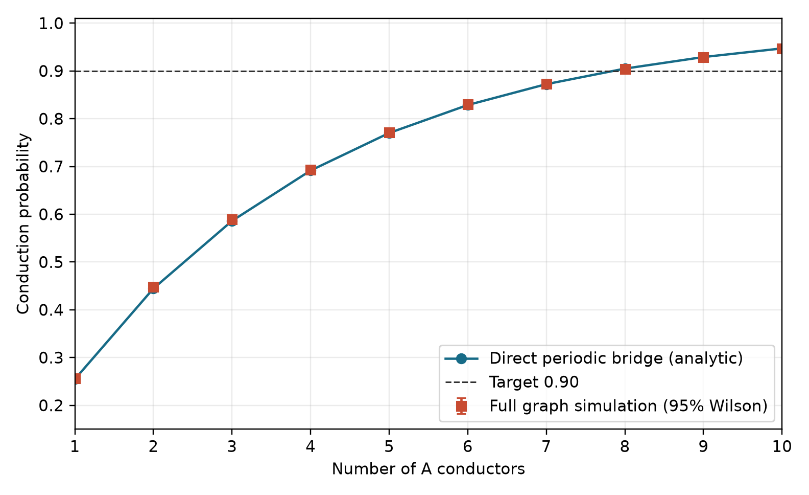
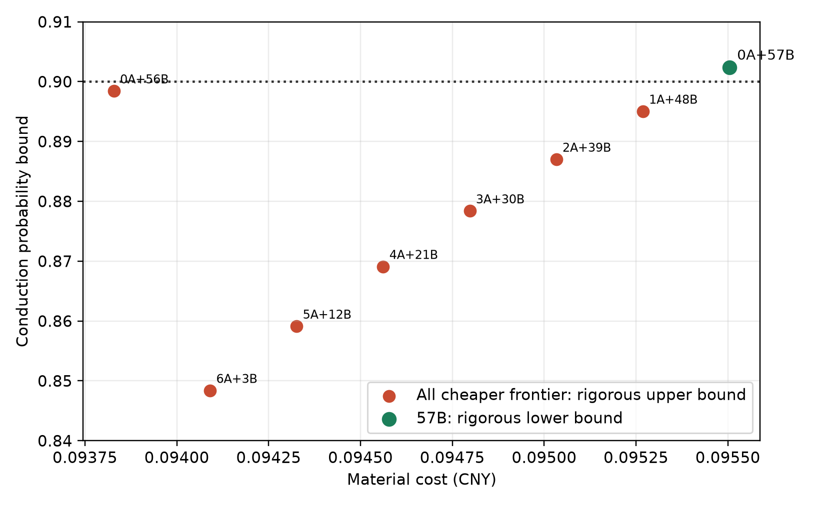

# 周期截断微构体的导通概率界与整数成本优化

## 摘要

本文研究边长 (10000\,\mathrm{nm}) 的微构体在边界截断规则下的左右导通问题。严格遵循附件说明“每一行表示一个介质 A”，将每行圆柱与左右带电面构造成无向图；对随机问题则提取“单个介质越过 X 边界后，其平移部分从对侧进入”这一直接贯通充分事件。我们推导单个 A、B 的直接贯通概率 (q_A=0.25471239)、(q_B=0.04)。为证明较低填充量不可能达到 90%，进一步指出：若没有任何介质直接贯通，则任何左右通路至少需要两个不同介质分别落入宽 (1.8\,\mathrm{nm}) 的左右电极接触层，由联合界得到与介质间距离算法无关的严格概率上界。

附件结果为：组1不导通，组2和组3导通；两组正例的显式路径分别为“左面—2—12—24—39—右面”和“左面—63—264—216—351—右面”，路径中的介质间最短点均位于两条轴段内部，因而是真实平端圆柱的侧面接触。A 体积分数为 0.50%、0.60%、0.70%、1.00% 时，粒子数分别为 354、424、495、707；仅直接贯通充分事件已使不导通概率分别小于 (10^{-45.20})、(10^{-54.13})、(10^{-63.20})、(10^{-90.27})。问题3中，8根 A 的导通概率下界为 0.904810，而7根 A 的总导通概率上界为 0.872279，因此最低填充量严格为8根，即 (0.01131\%)，按题意报告为 (0.01\%)。问题4中，57个 B 的导通概率下界为0.902398、成本为0.09550元；穷举全部216个成本更低的非负整数方案后，其最大概率上界仅为0.898431，故 `0A+57B` 为全整数域严格最优。若“同时填充”要求两种数量均为正，则穷举164个更便宜正混合方案后，最优解为 `1A+50B`，成本0.09862元。

**关键词：** 周期截断；随机几何图；联合界；整数优化；概率上下界

## 1 问题重述

微构体为边长 (L=10000\,\mathrm{nm}) 的立方体，左右带电面为 (x=-5000) 和 (x=5000)。介质 A 是高 (H=5000\,\mathrm{nm})、半径 (r_A=30\,\mathrm{nm}) 的直圆柱；介质 B 是半径 (r_B=200\,\mathrm{nm}) 的球。介质之间或介质与带电面的最短距离不超过 (g=1.8\,\mathrm{nm}) 时导通。越界部分平移一个边长并从对侧进入。

任务依次为：判断三组附件构型；计算四个 A 体积分数下的概率；求概率不低于90%的最低 A 填充量；求 A/B 最低成本填充方案。

## 2 假设与边界口径

1. 附件明确规定“每一行表示一个介质 A”，因此 Q1 不跨行推断周期身份，不把坐标 `±500` 当成立方体边界。
2. Q2–Q4 中介质中心独立且在立方体内均匀分布；A 的方向独立且在单位球面上均匀分布。这是计算概率必须补充的随机生成假设，所有概率结论均条件于此。
3. 只有实际越界部分按题面规则平移；未越界的两个介质不采用无条件最小镜像连接。
4. 允许介质重叠与贯穿，与题面一致。
5. Q1 的负例用“平端圆柱包含于同轴胶囊”反证；正例只接受最短点位于两轴段内部的侧面—侧面连接证书。

## 3 符号与体积成本

\[
V_A=\pi r_A^2H=1.4137167\times10^7\,\mathrm{nm}^3,
\qquad
V_B=\frac43\pi r_B^3=3.3510322\times10^7\,\mathrm{nm}^3.
\]

微构体体积 (V_0=L^3=10^{12}\,\mathrm{nm}^3=1000\,\mu\mathrm{m}^3)。整数数量与体积分数满足

\[
\phi_A=\frac{n_AV_A}{V_0},\qquad \phi_B=\frac{n_BV_B}{V_0}.
\]

成本函数为

\[
C=1000(1.05\phi_A+0.05\phi_B)
=0.0148440253n_A+0.00167551608n_B\quad(\mathrm{元}).
\]

## 4 Q1：附件的行级连通图

每一行作为一个 A 节点，另设左右虚拟节点。两轴段最短距离不超过 (2r_A+g=61.8\,\mathrm{nm}) 时，先在同轴胶囊超集中加入候选边。若最短点参数 (s,t\in(0,1))，接触发生在两个平端圆柱的侧面，候选边即为真实充分边。若最短点落在端点，则不能由胶囊距离直接宣称真实平端圆柱导通。

| 组别 | 行数 | 结论 | 显式通路 |
|---|---:|---|---|
| 组1 | 12 | 不导通 | 无 |
| 组2 | 49 | 导通 | 左—2—12—24—39—右 |
| 组3 | 535 | 导通 | 左—63—264—216—351—右 |

组1在更容易导通的胶囊超集中仍没有左右路径，因此真实平端圆柱必不导通。组2路径的三条内部边轴距为 55.832、1.441、49.073 nm；组3为 56.765、54.914、36.028 nm，所有最短点参数都严格位于 ((0,1))，故均为可审计的侧面接触。全对全计算与 KD 树宽相位得到相同边集。

## 5 单介质直接贯通概率

### 5.1 介质 A

设 A 的单位方向 X 分量为 (u_x)。平端圆柱在 X 方向的半宽为

\[
a_x=\frac H2|u_x|+r_A\sqrt{1-u_x^2}.
\]

中心距最近 X 边界不超过 (a_x) 时，圆柱实际越界并从对侧进入，形成直接左右通路。球面均匀方向下 (E|u_x|=1/2)、(E\sqrt{1-u_x^2}=\pi/4)，所以

\[
q_A=\frac{2E(a_x)}L
=\frac{H/2+2r_A(\pi/4)}L
=0.25471238898.
\]

### 5.2 介质 B

球心落在任一 X 边界内侧 (r_B) 范围内时球体越界，因此

\[
q_B=\frac{2r_B}{L}=0.04.
\]

独立生成下，至少一个介质直接贯通的概率为

\[
P_{\rm dir}(n_A,n_B)=1-(1-q_A)^{n_A}(1-q_B)^{n_B}.
\]

这是总导通概率的严格下界。

## 6 非直接通路的严格联合上界

如果没有介质直接贯通，任意左右通路至少需要两个不同介质：一个到左电极的距离不超过 (g)，另一个到右电极的距离不超过 (g)。对任意粒子，其中心落入指定电极接触薄层的概率不超过 (g/L=0.00018)。设总粒子数 (n=n_A+n_B)，对所有有序粒子对使用联合界：

\[
P(\text{非直接通路})
\le n(n-1)\left(\frac gL\right)^2.
\]

因此

\[
P_{\rm dir}\le P(\text{导通})
\le \min\left\{1,P_{\rm dir}+n(n-1)(g/L)^2\right\}.
\]

该上界不使用 A–A、A–B、B–B 的周期距离算法，也不受平端圆柱与胶囊端部差异影响。

## 7 Q2：四个体积分数

| 指定体积分数 | A 数量 | 实际体积分数 | (log_{10}P(不导通)) 上界 |
|---:|---:|---:|---:|
| 0.50% | 354 | 0.50046% | -45.20 |
| 0.60% | 424 | 0.59942% | -54.13 |
| 0.70% | 495 | 0.69979% | -63.20 |
| 1.00% | 707 | 0.99950% | -90.27 |



故四个导通概率在通常数值报告精度内均为 1。这里给出的是仅靠直接越界得到的保守结论，粒子间连接只会提高概率。

## 8 Q3：最低 A 填充量

8 根 A 的严格概率下界为

\[
1-(1-q_A)^8=0.904810024>0.90.
\]

7 根 A 的严格概率上界为

\[
1-(1-q_A)^7+7\times6(g/L)^2
=0.872278889<0.90.
\]



因此最低数量严格为8根，对应

\[
\phi_A^*=\frac{8V_A}{V_0}=0.0113097\%.
\]

按题意保留百分号后两位为 **0.01%**；同时必须保留“8根”这一整数结果，避免连续百分比四舍五入产生歧义。

## 9 Q4：全整数成本优化

### 9.1 允许某种介质数量为零

候选 `0A+57B` 的直接贯通概率为

\[
1-(1-q_B)^{57}=0.902397648>0.90,
\]

成本为 0.0955044 元。我们穷举所有满足 (C<0.0955044) 的非负整数对，共216个。由于固定 (n_A) 时概率界随 (n_B) 单调，只需展示7个最大 B 前沿点：

| A+B | 成本/元 | 总导通概率严格上界 |
|---|---:|---:|
| 0A+56B | 0.093829 | 0.898431 |
| 1A+48B | 0.095269 | 0.895039 |
| 2A+39B | 0.095033 | 0.887015 |
| 3A+30B | 0.094798 | 0.878385 |
| 4A+21B | 0.094562 | 0.869104 |
| 5A+12B | 0.094326 | 0.859121 |
| 6A+3B | 0.094091 | 0.848382 |



所有更低成本整数方案的上界都小于0.90，而57B的下界大于0.90，故 **0A+57B 是全整数域严格最优解**。B 体积分数为0.191009%，总成本为 **0.09550元**。

### 9.2 若强制两种介质均为正数

若“同时填充”被解释为 (n_A,n_B\ge1)，完整穷举164个更便宜正混合方案后，最优为 **1A+50B**：直接贯通概率下界0.903198，成本 **0.09862元**。其更便宜域中的最大概率上界来自1A+49B，仅0.899244。

## 10 验证与局限

1. Q1 线段距离通过相交、平行、端点和端点换序测试；正路径逐边保存最短点参数，负例在胶囊超集中反证。
2. Q3、Q4 使用解析上下界，不存在蒙特卡洛抽样误差、多重选择或 Wilson 区间误读。
3. Q4 由程序穷举全部216个更低成本非负整数方案，并另行穷举164个更低成本正混合方案。
4. 概率结果条件于中心独立均匀、方向各向同性。若实际材料存在团聚、排斥、取向偏置或相关生成机制，需重新计算 (q_A,q_B) 与联合界。
5. 附件组1/2的 Y、Z 坐标出现 `±500`，但题面立方体边界是 `±5000`；本文未把 `±500` 当作周期边界，而严格按每行一个介质处理。

## 11 结论

1. 组1不导通；组2和组3导通。
2. 四个指定 A 体积分数的导通概率在报告精度内均为1。
3. 最低 A 填充量为8根，即0.01131%，按题意报告0.01%。
4. 允许数量为零时，最低成本方案为0A+57B，成本0.09550元；若两种都必须填充，则为1A+50B，成本0.09862元。

## 参考文献

[1] 2026年第七届“华数杯”大学生数学建模竞赛组委会. A题：微构体中填充导电介质的仿真优化, 2026.

[2] Boole G. *An Investigation of the Laws of Thought*. London: Walton and Maberly, 1854.（联合界）

[3] linggm3. 2023 CUMCM National First Prize repository, commit `486768dc1aa6e74622f8b0628ae32db3b51291f4`. <https://github.com/linggm3/2023_CUMCM_National-First-Prize>. 仅用于结构化建模方法启发。

## 附录：复现命令

```powershell
python -m pip install -r requirements.txt
python -m pytest tests -q
python src/a/build_corrected_results.py
python src/a/build_final_artifacts.py
python src/a/build_evidence_registry.py
python ../../math-modeling-competition/scripts/check_evidence.py evidence/claim_evidence.json evidence/artifact_registry.json --root .
```

权威机器结果为 `outputs/data/final_results.json`。
