# 周期边界下导电介质填充的连通概率界与整数成本优化

## 摘要

本文研究周期立方微构体中导电介质的左右导通判定、随机填充概率估计与成本优化问题。针对附件给出的确定性构型，将每个平端圆柱视为图节点，以介质间最短距离和介质—电极距离为连边准则；对胶囊超集给出的候选边，再以轴段内部最短点参数作为平端圆柱侧面接触证书。针对随机填充，利用周期边界产生的单粒子直接贯通事件构造总导通概率下界，并对“无直接贯通但仍存在通路”的剩余事件建立终端薄壳联合上界。最后在整数域内完整枚举低成本方案，分别讨论允许某类介质数量为零和两类介质均为正两种题意口径。

结果表明：附件组1不导通，组2和组3导通，显式通路分别为左面-2-12-24-39-右面和左面-63-264-216-351-右面。A 的体积分数为0.50%、0.60%、0.70%和1.00%时，仅直接贯通事件已使不导通概率上界分别降至10^-45.20、10^-54.13、10^-63.20和10^-90.27量级。仅填充A时，7根A的总导通概率上界为0.872279，8根A的直接贯通概率下界为0.904810，故达到90%导通概率的最小数量为8根，对应体积分数0.01131%，按百分号后两位报告为0.01%。

混合填充中，若允许某类介质数量为零，非负整数域最优方案为0A+57B，成本0.09550元；若“同时填充”要求两类介质均出现，则正混合域最优方案为1A+50B，成本0.09862元。全文区分精确概率、严格下界和严格上界，阈值与最优性结论均由相邻不可行方案的上界证据闭合。

**关键词：** 周期边界；随机几何图；导通概率界；联合界；整数优化

## 1  问题重述与问题分析

### 1.1  问题背景与研究对象

题目给定边长L=10000 nm的立方微构体，左右带电面位于x=-5000 nm与x=5000 nm。当导电介质之间或介质与带电面的表面最短距离不超过g=1.8 nm时，视为接触导通。介质A为高度H=5000 nm、半径r_A=30 nm的平端直圆柱；介质B为半径r_B=200 nm的球。边界采用周期平移截断规则，即越过边界的部分从对侧进入且仍属于同一导体。图1概括了几何对象和接触口径。

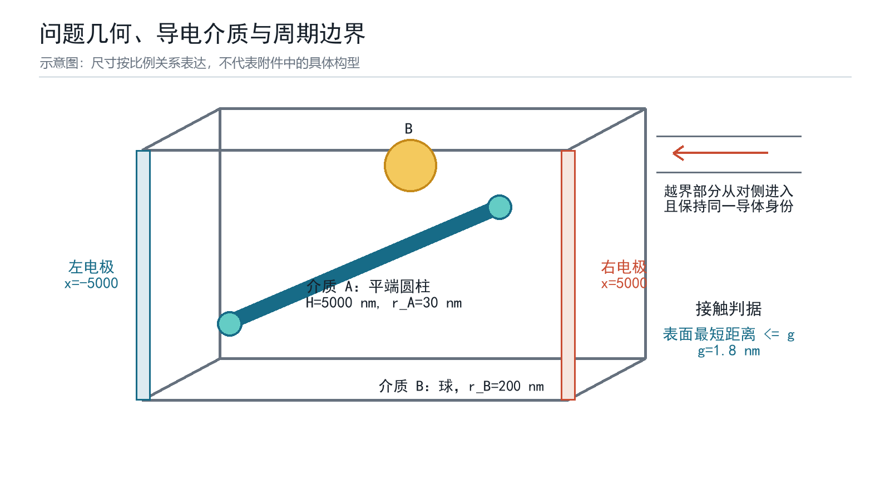

图1  问题几何、介质类型与周期边界示意

### 1.2  四个问题的输入、输出与难点

问题一的输入是附件中的三组圆柱轴段坐标，输出是每组是否导通及可复核的通路；难点在于平端圆柱不能直接等同于端部为半球的胶囊体。问题二将确定性坐标改为随机位置和随机方向，要求计算四个体积分数下的导通概率。问题三寻找仅填充A且导通概率不低于90%的最低填充率，需要同时证明候选值充分和前一整数不足。问题四加入B及材料成本，形成带概率约束的二元整数优化，并存在“是否允许某类介质数量为零”的题意歧义。

### 1.3  总体技术路线

本文把四问组织为三个层次：第一层为确定性几何图和路径证书；第二层为所有随机问题共享的直接贯通下界与非直接通路上界；第三层为基于概率界的整数阈值和成本优化。该结构使Q2-Q4共享同一母模型，避免每问重复定义概率口径。技术路线如图2所示。

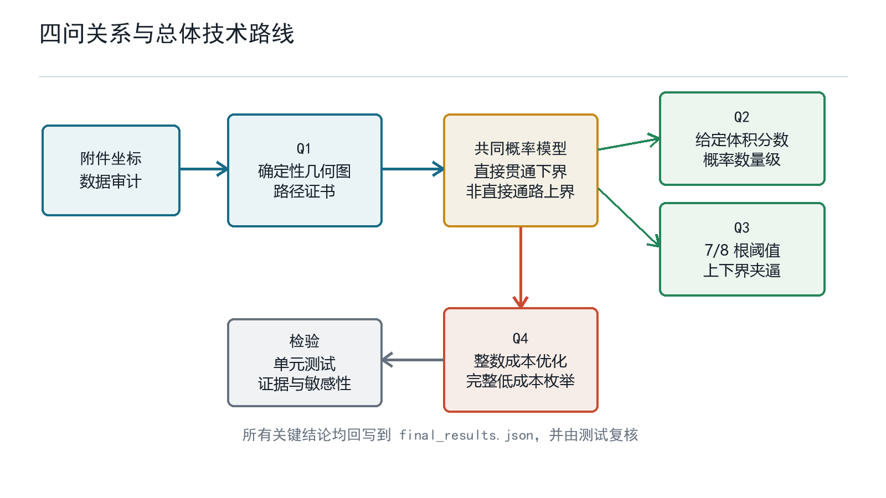

图2  四问依赖关系与总体技术路线

## 2  模型假设、符号与量纲

### 2.1  题面条件与补充假设

**表1  题面条件、补充假设及失效影响**

| 类别 | 内容 | 使用位置 | 改变后的影响 |
| --- | --- | --- | --- |
| 题面条件 | 每行附件数据表示一个A；边界越界部分周期平移 | Q1-Q4 | 改变介质身份或周期解释会改变全部结果 |
| 几何口径 | Q1保持附件轴段的截断状态，不擅自延长为5000 nm | Q1 | 延长会制造非真实接触边 |
| 补充假设 | 介质中心独立且在立方体内均匀分布 | Q2-Q4 | 排斥或团聚会破坏独立乘积式 |
| 补充假设 | A的轴向独立且各向同性 | Q2-Q4 | 取向偏置会改变q_A及整数阈值 |
| 补充假设 | 随机介质允许重叠，忽略制造排斥 | Q2-Q4 | 不可重叠时需改用相关随机几何模型 |

### 2.2  主要符号

**表2  主要符号及含义**

| 符号 | 含义 | 取值或单位 |
| --- | --- | --- |
| L | 立方体边长 | 10000 nm |
| g | 表面导通阈值 | 1.8 nm |
| H, r_A | 介质A的高度与半径 | 5000 nm, 30 nm |
| r_B | 介质B半径 | 200 nm |
| n_A, n_B | A、B填充数量 | 非负整数 |
| a_x | 粒子在x方向的支撑半宽 | nm |
| D | 至少一个粒子直接贯通事件 | 事件 |
| T | 整体左右导通事件 | 事件 |
| S_i^L, S_i^R | 粒子i未越界但接触左/右电极的剩余薄壳事件 | 事件 |
| P_dir | 直接贯通事件D的概率 | [0,1] |
| C | 材料成本 | 元 |

### 2.3  体积与成本换算

$$ V_A=pi*r_A^2*H=1.4137167e7 nm^3,  V_B=4*pi*r_B^3/3=3.3510322e7 nm^3 	ag{1} $$

$$ C=1.05*V_A*n_A/1e9+0.05*V_B*n_B/1e9=0.0148440253*n_A+0.0016755161*n_B 	ag{2} $$

式(1)按真实圆柱与球体积计算，式(2)把nm^3换算为um^3。所有数量先在整数域内求解，体积分数仅作为结果的物理表达，不用四舍五入后的体积分数反推粒子数。

## 3  问题一：确定性构型的几何连通模型

### 3.1  附件数据审计

三组附件分别包含12、49和535个介质A。轴段长度范围为1019.117-5000.000 nm、577.474-5000.000 nm和525.697-5000.000 nm，说明附件中存在大量边界截断轴段。组1、组2和组3触及任一边界面的介质比例分别为58.3%、44.9%和71.0%。因此不能把所有截断轴段无条件延长，也不能因端点落在边界上而跨行合并介质身份。数据特征见图3。

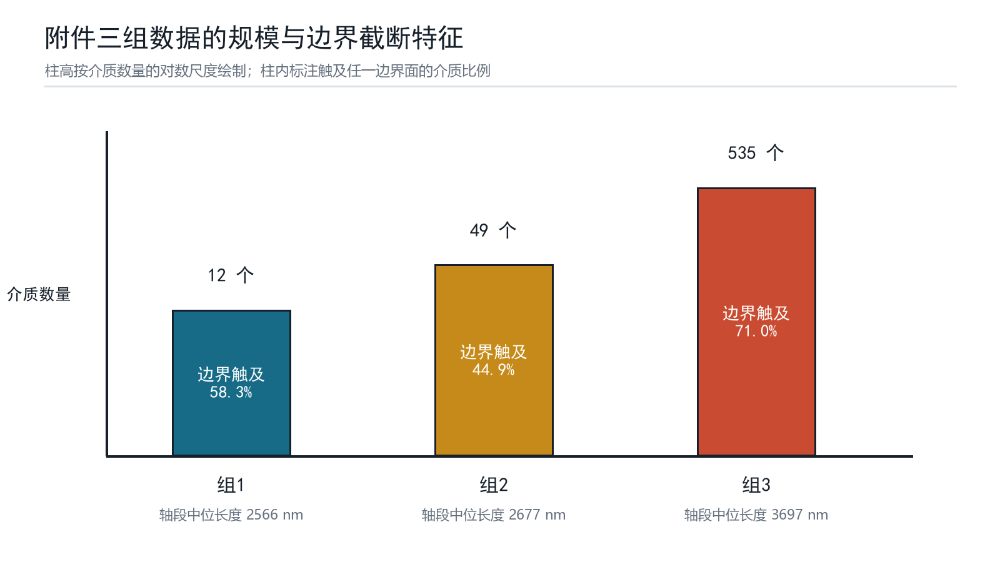

图3  附件三组数据规模与边界截断特征

### 3.2  行级连通图

建立无向图G=(V,E)。V由两个虚拟电极节点LEFT、RIGHT和每一行对应的圆柱节点组成。若圆柱与电极的最短距离不超过g，则连接圆柱节点与相应电极；若两个圆柱的表面最短距离不超过g，则连接对应节点。LEFT与RIGHT位于同一连通分量当且仅当该构型导通。

$$ (i,j) in E  iff  dist(A_i,A_j)<=g;   (LEFT,i) in E  iff  dist(A_i,F_L)<=g 	ag{3} $$

### 3.3  平端圆柱的候选边与充分证书

两条轴段的最短距离不超过2r_A+g=61.8 nm时，相应胶囊体必接触，因此该条件可用于生成候选边。但胶囊体把圆柱端部替换为半球，可能把端点附近接近误判为平端圆柱接触。为避免这一问题，对正例路径中的每条圆柱—圆柱边保存轴段最短点参数s,t。当0<s<1且0<t<1时，两个最短点均位于轴段内部，表面间隙等于max(0,d_axis-2r_A)，可作为真实侧面接触的充分证书。对负例，胶囊体是平端圆柱的超集；若胶囊超图仍不连通，则真实图一定不连通。图4解释了证书条件。

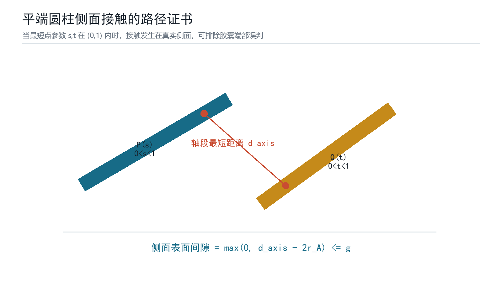

图4  平端圆柱侧面接触的轴段最短点证书

### 3.4  三组构型的求解结果

对每组数据先计算电极接触，再全对全生成候选边，以广相位空间索引复核边数，最后用广度优先搜索恢复一条LEFT-RIGHT路径。图5和图6从x-y、x-z两个投影展示全部轴段及显式路径；投影只用于解释，最终连边仍在三维空间中计算。

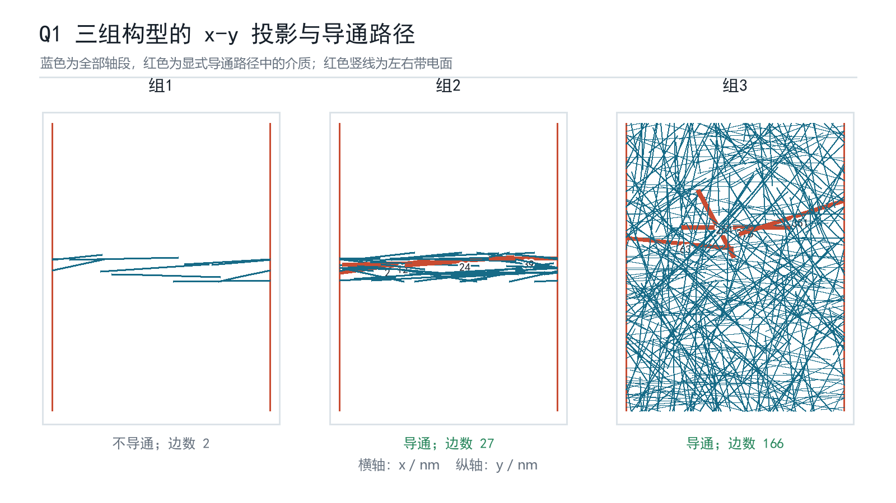

图5  三组构型的x-y投影与显式导通路径

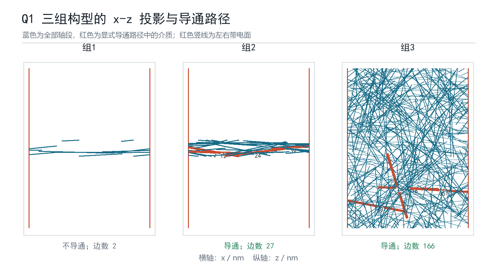

图6  三组构型的x-z投影与显式导通路径

**表3  Q1三组附件构型的连通结果**

| 组别 | 节点数 | 边数 | 左接触 | 右接触 | 结论 | 显式路径 |
| --- | --- | --- | --- | --- | --- | --- |
| 组1 | 12 | 2 | 3 | 4 | 不导通 | 无 |
| 组2 | 49 | 27 | 11 | 11 | 导通 | 左面-2-12-24-39-右面 |
| 组3 | 535 | 166 | 92 | 90 | 导通 | 左面-63-264-216-351-右面 |

组1在更易连通的胶囊超图中仅有2条介质间边，LEFT与RIGHT仍分属不同连通分量，因此真实平端圆柱构型必不导通。组2和组3均找到显式路径；表4列出的6条介质间边均满足s,t位于(0,1)，故正例不依赖胶囊端部近似。

**表4  Q1正例路径的侧面接触证书**

| 组别 | 边 | 轴距/nm | s | t | 证书 |
| --- | --- | --- | --- | --- | --- |
| 组2 | 2-12 | 55.832 | 0.661 | 0.522 | 通过 |
| 组2 | 12-24 | 1.441 | 0.919 | 0.346 | 通过 |
| 组2 | 24-39 | 49.073 | 0.970 | 0.310 | 通过 |
| 组3 | 63-264 | 56.765 | 0.962 | 0.882 | 通过 |
| 组3 | 264-216 | 54.914 | 0.535 | 0.324 | 通过 |
| 组3 | 216-351 | 36.028 | 0.722 | 0.199 | 通过 |

## 4  Q2-Q4共享的随机填充概率模型

### 4.1  单粒子直接贯通事件

若某粒子在x方向跨越任一周期边界，其越界片段从对侧进入且保持同一导体身份，于是该粒子自身形成左右贯通。该事件是总导通事件T的充分条件而非必要条件，因此由它得到的是严格概率下界。图7分别示意圆柱A和球B的直接贯通机制。

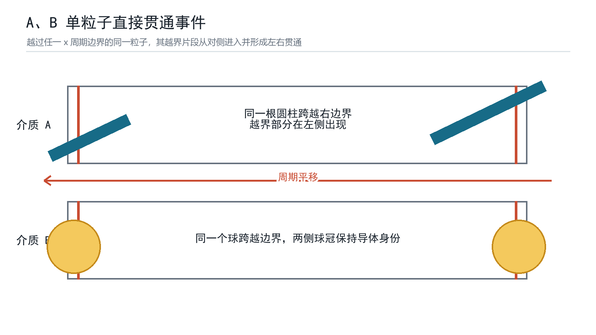

图7  A、B单粒子跨越周期边界的直接贯通机制

### 4.2  圆柱A的直接贯通概率

设圆柱轴向单位向量的x分量为u_x。平端圆柱在x方向的支撑半宽由轴向投影和端面圆盘投影共同组成。固定方向后，圆柱中心落入任一边界内侧a_x范围即越界，两侧合计条件概率为2a_x/L。

$$ a_x=(H/2)*abs(u_x)+r_A*sqrt(1-u_x^2) 	ag{4} $$

各向同性方向满足E|u_x|=1/2以及E sqrt(1-u_x^2)=pi/4，故对方向积分可得q_A。图8给出条件越界概率随|u_x|的变化及其方向平均。

$$ q_A=2*E(a_x)/L=(H/2+pi*r_A/2)/L=0.25471238898 	ag{5} $$

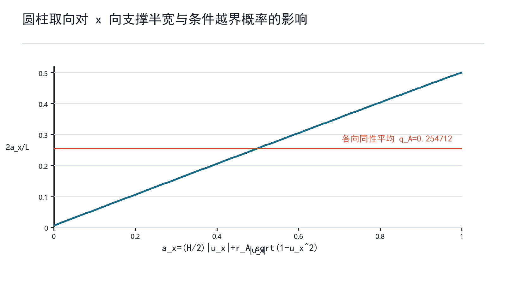

图8  圆柱取向对支撑半宽和条件越界概率的影响

### 4.3  球B与多粒子的直接贯通下界

球的支撑半宽恒为r_B，故球心落入任一边界内侧r_B范围即可越界。不同粒子的位置和方向独立时，至少一个粒子直接贯通的概率可由补事件乘积得到。

$$ q_B=2*r_B/L=0.04 	ag{6} $$

$$ P_dir=P(D)=1-(1-q_A)^n_A*(1-q_B)^n_B 	ag{7} $$

### 4.4  非直接通路的剩余薄壳联合上界

为证明某个较低填充方案不可能达到90%，仅有下界不够。定义D_i为粒子i直接越界，C_i^L为粒子i接触左电极。固定其x向支撑半宽a_i时，无条件接触层宽为a_i+g，因此不能把P(C_i^L)误写成g/L。关键在于研究无直接贯通事件D^c中的剩余接触：粒子既不越界又接触左电极时，中心只能位于宽度恰为g的薄壳。

$$ S_i^L=C_i^L intersect D_i^c={-L/2+a_i<X_i<=-L/2+a_i+g},  P(S_i^L)=g/L 	ag{8} $$

令N=T交D^c。任何N中的左右路径都必须包含不同的终端粒子i和j，分别落入左、右剩余薄壳；若由同一粒子承担两端接触，则该粒子已经属于直接贯通事件D。对所有有序粒子对使用独立性和Boole联合界[3]，得到式(9)。事件关系见图9。

$$ P_dir<=P(T)<=min{1, P_dir+n*(n-1)*(g/L)^2},  n=n_A+n_B 	ag{9} $$

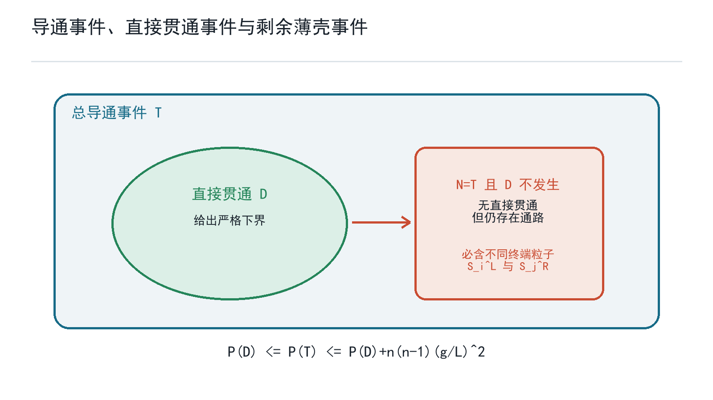

图9  总导通、直接贯通与剩余薄壳事件的上下界关系

### 4.5  概率模型的解释边界

式(9)的上界用于证明“不足”，不用于精确估计真实导通概率；它忽略了中间粒子如何连接，因此通常偏松，但不会漏掉曲折通路。式(8)的下界用于证明“充分”，也不等于总导通概率。只有当上下界位于阈值两侧时，才能给出严格整数阈值或最优性结论。若粒子中心存在排斥、团聚或取向相关，式(8)中的独立乘积和式(9)中的跨粒子独立性需要重建。

## 5  问题二：给定体积分数下的导通概率

### 5.1  体积分数到整数数量的换算

设目标体积分数为phi。粒子数必须取整数，本文选择使n_A V_A/L^3最接近目标phi的整数n_A，并同时报告目标值与实际值。四个目标体积分数对应354、424、495和707根A。

$$ n_A=round(phi*L^3/V_A),  phi_actual=n_A*V_A/L^3 	ag{10} $$

### 5.2  概率结果与解释

**表5  Q2体积分数、整数数量与直接贯通下界**

| 目标体积分数 | A数量 | 实际体积分数 | log10不导通上界 | 导通概率下界 |
| --- | --- | --- | --- | --- |
| 0.50% | 354 | 0.50046% | -45.20 | 至少1-10^-45.20 |
| 0.60% | 424 | 0.59942% | -54.13 | 至少1-10^-54.13 |
| 0.70% | 495 | 0.69979% | -63.20 | 至少1-10^-63.20 |
| 1.00% | 707 | 0.99950% | -90.27 | 至少1-10^-90.27 |

表5中的“不导通上界”仅考虑没有任何A直接贯通的概率(1-q_A)^n_A。粒子间进一步接触只会增加总导通概率，因此该量确为总不导通概率的上界。四个数量级远低于常规数值显示精度，故可以表述为“在报告精度内导通概率为1”，但不能写成数学上精确等于1。图10展示其对数数量级。

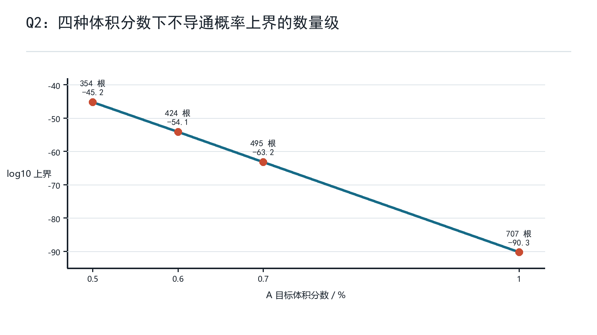

图10  Q2四种体积分数下不导通概率上界的数量级

## 6  问题三：仅填充A的最低填充量

### 6.1  候选阈值定位

由式(8)可知直接贯通下界随n_A单调增加。解1-(1-q_A)^n_A>=0.90可将候选值定位在8根。证明“8根是最小值”还需验证8根充分和7根不足。

$$ n_A>=ceil(log(0.10)/log(1-q_A))=8 	ag{11} $$

### 6.2  7根不足与8根充分

当n_A=8时，直接贯通概率下界为0.9048100243>0.90，故8根充分。当n_A=7时，直接贯通概率为0.8722775285；剩余非直接通路上界增量为7*6*(1.8/10000)^2=1.3608e-6，因而总导通概率上界为0.8722788893<0.90，故7根不足。图11显示上下界几乎重合但分别位于阈值两侧。

**表6  Q3从1至8根A的导通概率上下界**

| A数量 | 直接贯通下界 | 非直接上界增量 | 总导通上界 |
| --- | --- | --- | --- |
| 1 | 0.254712 | 0.00e+00 | 0.254712 |
| 2 | 0.444546 | 6.48e-08 | 0.444546 |
| 3 | 0.586027 | 1.94e-07 | 0.586027 |
| 4 | 0.691471 | 3.89e-07 | 0.691472 |
| 5 | 0.770057 | 6.48e-07 | 0.770058 |
| 6 | 0.828627 | 9.72e-07 | 0.828628 |
| 7 | 0.872278 | 1.36e-06 | 0.872279 |
| 8 | 0.904810 | 1.81e-06 | 0.904812 |

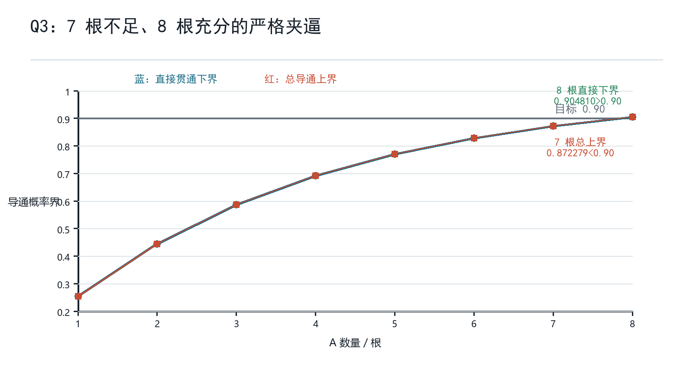

图11  Q3中7根不足、8根充分的严格夹逼

### 6.3  填充率报告

8根A对应体积分数8V_A/L^3=0.0001130973，即0.01131%。若按百分号后保留两位，应报告0.01%；但必须同时保留“8根”和未过度舍入的0.01131%，因为相邻整数在两位百分数下可能显示相同。

## 7  问题四：混合填充的整数成本优化

### 7.1  优化模型

以n_A,n_B为整数决策变量，目标是最小化式(2)的材料成本，约束为总导通概率不低于0.90。由于总导通概率难以精确闭式计算，本文采用“候选方案用下界证明可行、所有更便宜方案用上界证明不可行”的双向证书。

$$ min C(n_A,n_B),  s.t. P(T)>=0.90,  n_A,n_B in nonnegative integers 	ag{12} $$

### 7.2  非负整数域的边界解

若允许某一类介质数量为零，0A+57B的直接贯通下界为0.9023976480，成本0.0955044元，故该方案可行。以该成本为上限，枚举全部216个更低成本非负整数点；其中总导通上界最大的是0A+56B，上界0.8984306753<0.90。因此所有更便宜方案均不可行，0A+57B在非负整数域严格最优。

### 7.3  两类介质均为正的主口径

题目中的“同时填充A、B”可能要求两类介质均出现。增加n_A>=1,n_B>=1后，1A+50B的直接贯通下界为0.9031977272，成本0.0986198元。枚举164个更低成本正混合点后，最危险方案1A+49B的总导通上界为0.8992436792<0.90。因此若按“同时填充”解释，应把1A+50B作为正式答案，0A+57B仅作为放宽约束后的对照。

**表7  Q4低成本前沿与两种口径的候选解**

| 方案 | 成本/元 | 直接下界 | 总上界 | 结论 |
| --- | --- | --- | --- | --- |
| 0A+56B | 0.093829 | 0.898331 | 0.898431 | 更便宜，不可行 |
| 1A+48B | 0.095269 | 0.894963 | 0.895039 | 更便宜，不可行 |
| 2A+39B | 0.095033 | 0.886962 | 0.887015 | 更便宜，不可行 |
| 3A+30B | 0.094798 | 0.878351 | 0.878385 | 更便宜，不可行 |
| 4A+21B | 0.094562 | 0.869084 | 0.869104 | 更便宜，不可行 |
| 5A+12B | 0.094326 | 0.859112 | 0.859121 | 更便宜，不可行 |
| 6A+3B | 0.094091 | 0.848380 | 0.848382 | 更便宜，不可行 |
| 0A+57B | 0.095504 | 0.902398 | - | 非负整数域最优 |
| 1A+50B | 0.098620 | 0.903198 | - | 正混合域最优 |

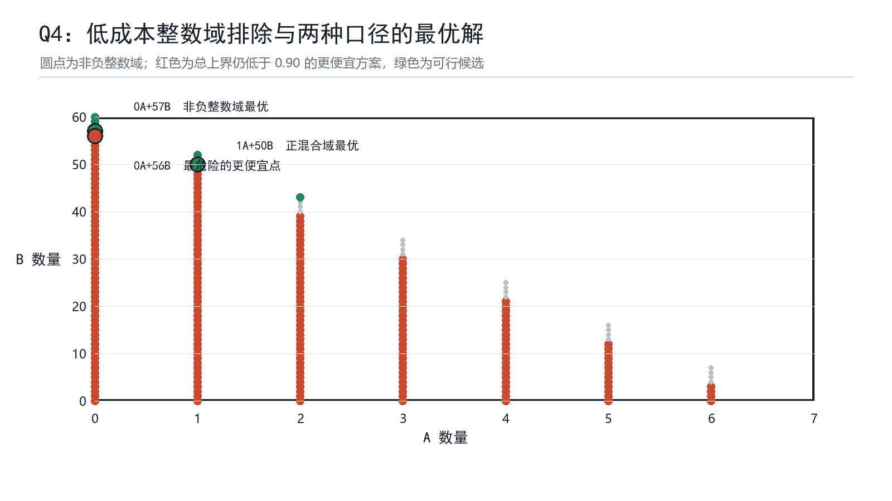

图12  Q4低成本整数域排除与两种口径的最优解

### 7.4  成本效率解释

A单体直接贯通概率高，但单体成本约为B的8.86倍；B虽需要更多数量，却具有更高的单位成本概率收益，因此非负整数域最优点落在纯B边界。强制两类均出现时，加入1根A可以减少7个B，形成1A+50B的正混合最优点。该解释只针对本题给定价格和尺寸，若B单价上升或半径改变，整数前沿会发生跳变。

## 8  模型检验、灵敏度与稳健性

### 8.1  几何算法检验

几何测试覆盖平行、相交、端点最近、轴段换序和多对批量计算等情形；对附件三组数据，全对全枚举与KD树广相位得到相同的连通结论和边数。正例路径逐边检查s,t与轴距，负例则利用胶囊超集反证。当前测试共16项通过，其中新增测试明确区分无条件电极接触层a_i+g与非越界剩余薄壳g，防止把g/L误写成无条件接触概率。

### 8.2  概率与整数域复核

q_A由方向积分解析得到，q_B由球的边界层宽度直接得到；Q3分别重算7根上界与8根下界。Q4不是只比较表7中的前沿点，而是完整枚举成本严格低于候选的所有整数点，再取其总导通上界最大者。因此216和164是搜索域内实际候选数，不是抽样规模。

### 8.3  几何参数灵敏度

保持其他参数不变，A高度H增大时q_A线性增大，达到90%所需A数量呈阶梯下降；B半径增大时q_B=2r_B/L增大，达到90%所需B数量下降。图13给出H在3500-6500 nm、r_B在120-280 nm范围内的阈值变化。基准H=5000 nm对应8根A，r_B=200 nm对应57个B。

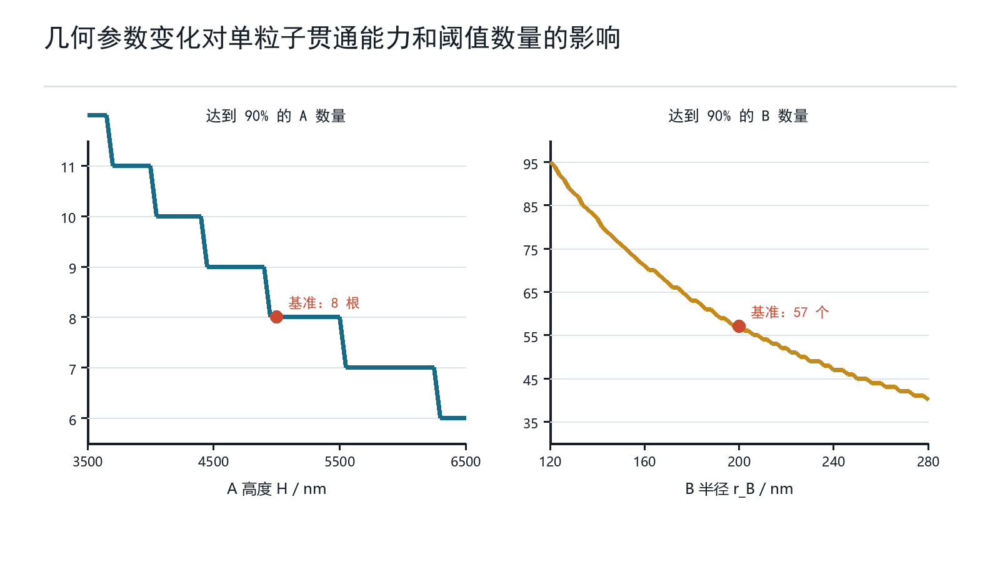

图13  A高度与B半径变化对90%阈值数量的影响

### 8.4  假设敏感性与失效情形

**表8  关键假设变化对结论的影响**

| 变化 | 直接影响 | 最可能受影响的结论 | 建议改进 |
| --- | --- | --- | --- |
| A取向偏向x轴 | q_A增大 | Q3阈值下降，Q4更偏向A | 用实测取向分布替代各向同性积分 |
| 粒子不可重叠 | 位置不再独立 | Q2-Q4乘积式和联合界需重建 | 随机序列吸附或排斥点过程模拟 |
| 粒子团聚 | 局部连接增强但边界分布改变 | 总概率与解析界间隙增大 | 相关随机几何图与蒙特卡洛校准 |
| 周期片段不保持导体身份 | 直接贯通事件失效 | Q2-Q4全部数值失效 | 按新边界物理重新定义连接图 |
| 要求A、B均出现 | 可行域删去坐标轴 | Q4主答案变为1A+50B | 论文同时报告两种口径 |

## 9  模型评价与改进

### 9.1  模型优点

第一，Q1采用路径证书而非只给程序布尔值，负例和正例分别由超集反证与侧面充分证书支撑。第二，Q2-Q4明确区分精确直接贯通概率、总导通下界和总导通上界，避免把蒙特卡洛频率或下界误当作真实概率。第三，Q4对候选成本以下的有限整数域完整枚举，最优性证据可逐点复算。第四，所有关键数值集中写入结构化结果文件并由测试检查，论文图表直接从附件和结果文件生成。

### 9.2  模型局限

随机模型的主要局限是独立均匀、各向同性和允许重叠三项补充假设不一定符合真实材料制备。非直接通路联合上界只适合做不足性证明，不能精确刻画粒子间簇连通。Q1的正例证书只需证明所给路径有效，不代表候选图中的所有端部边都已完成严格平端圆柱距离分类。

### 9.3  后续改进

后续可在三方面扩展：其一，实现平端圆柱—圆柱、圆柱—球的完整最近距离求解器，替代胶囊候选超图；其二，引入不可重叠随机序列吸附、取向偏置或团聚点过程，并用方差缩减蒙特卡洛估计真实导通概率；其三，在解析界与模拟之间建立校准区间，使模型既能证明阈值，又能给出阈值以外更精细的工程概率估计。

## 10  结论

(1) 附件组1不导通，组2和组3导通；组2显式路径为左面-2-12-24-39-右面，组3为左面-63-264-216-351-右面。所有正例介质间边均具有轴段内部最短点证书。

(2) A体积分数0.50%、0.60%、0.70%和1.00%对应354、424、495和707根A；总不导通概率分别不超过10^-45.20、10^-54.13、10^-63.20和10^-90.27量级。

(3) 仅填充A时，7根的总导通上界0.872279低于90%，8根的直接贯通下界0.904810高于90%，故最小数量为8根；体积分数为0.01131%，按百分号后两位报告为0.01%。

(4) 混合填充时，非负整数域最优为0A+57B，成本0.09550元；若A、B必须均出现，则正混合域最优为1A+50B，成本0.09862元。后者应作为“同时填充”口径下的主答案。

## 参考文献

[1] 华数杯大学生数学建模竞赛组委会，2026年第七届华数杯大学生数学建模竞赛A题：微构体中填充导电介质的仿真优化，2026。

[2] 华数杯大学生数学建模竞赛组委会，2026年华数杯数学建模竞赛论文格式规范与提交说明，https://m.saikr.com/chinamcm26，访问日期：2026-08-13。

[3] Feller W. An Introduction to Probability Theory and Its Applications, Vol. 1. New York: Wiley, 1968.

[4] Ericson C. Real-Time Collision Detection. Boca Raton: CRC Press, 2005.

[5] Meester R, Roy R. Continuum Percolation. Cambridge: Cambridge University Press, 1996.

## 附录A  复现环境与命令

软件环境：Python 3.13；numpy 2.2.6；pandas 3.0.3；openpyxl 3.1.5；scipy 1.16.3；pytest 9.1.0。图表和文档生成使用工作区绑定运行时。

```python
cd mathmodel/runs/huashubei-2026-final-001
python -m pip install -r requirements.txt
python src/a/build_corrected_results.py
python src/a/build_final_artifacts.py
python -m pytest tests -q
```

当前仓库完整测试共46项通过，项目证据登记表与论文正文哈希可由随附脚本重建和复核。

## 附录B  关键源程序

### B.1  src/a/analytic_bounds.py

```python
"""Rigorous direct-bridge bounds for the official periodic clipping rule."""

from __future__ import annotations

import math
from dataclasses import dataclass


BOX_SIDE = 10_000.0
GAP = 1.8
ROD_LENGTH = 5_000.0
ROD_RADIUS = 30.0
SPHERE_RADIUS = 200.0
CUBE_VOLUME = BOX_SIDE**3
A_VOLUME = math.pi * ROD_RADIUS**2 * ROD_LENGTH
B_VOLUME = 4 * math.pi * SPHERE_RADIUS**3 / 3
A_COST = 1.05 * A_VOLUME / 1e9
B_COST = 0.05 * B_VOLUME / 1e9


Q_A = ROD_LENGTH / (2 * BOX_SIDE) + 2 * ROD_RADIUS * (math.pi / 4) / BOX_SIDE
Q_B = 2 * SPHERE_RADIUS / BOX_SIDE


def direct_bridge_probability(a_count: int, b_count: int) -> float:
    return 1 - (1 - Q_A) ** a_count * (1 - Q_B) ** b_count


def non_direct_terminal_pair_upper_bound(a_count: int, b_count: int) -> float:
    """Upper-bound a non-direct path by opposite-electrode endpoint contacts.

    If no particle directly wraps from left to right, every conducting path must
    contain distinct particles touching the two electrode gap layers. A union
    bound over ordered particle pairs is independent of inter-particle geometry.
    """
    per_side = GAP / BOX_SIDE
    total = a_count + b_count
    return total * (total - 1) * per_side**2


def conduction_upper_bound(a_count: int, b_count: int) -> float:
    return min(
        1.0,
        direct_bridge_probability(a_count, b_count)
        + non_direct_terminal_pair_upper_bound(a_count, b_count),
    )


def material_cost(a_count: int, b_count: int) -> float:
    return a_count * A_COST + b_count * B_COST


@dataclass(frozen=True)
class IntegerCandidate:
    a_count: int
    b_count: int

    @property
    def cost(self) -> float:
        return material_cost(self.a_count, self.b_count)

    @property
    def lower(self) -> float:
        return direct_bridge_probability(self.a_count, self.b_count)

    @property
    def upper(self) -> float:
        return conduction_upper_bound(self.a_count, self.b_count)


def enumerate_cheaper_than(
    reference: IntegerCandidate, *, min_a: int = 0, min_b: int = 0
) -> list[IntegerCandidate]:
    candidates: list[IntegerCandidate] = []
    max_a = int(math.floor((reference.cost - 1e-15) / A_COST))
    for a_count in range(min_a, max_a + 1):
        remaining = reference.cost - a_count * A_COST
        max_b = int(math.floor((remaining - 1e-15) / B_COST))
        for b_count in range(min_b, max_b + 1):
            candidate = IntegerCandidate(a_count, b_count)
            if candidate.cost < reference.cost - 1e-15:
                candidates.append(candidate)
    return candidates


def cheaper_frontier(
    reference: IntegerCandidate, *, min_a: int = 0, min_b: int = 0
) -> list[IntegerCandidate]:
    candidates = enumerate_cheaper_than(reference, min_a=min_a, min_b=min_b)
    frontier: list[IntegerCandidate] = []
    for a_count in sorted({candidate.a_count for candidate in candidates}):
        options = [candidate for candidate in candidates if candidate.a_count == a_count]
        frontier.append(max(options, key=lambda candidate: candidate.b_count))
    return frontier


def prove_q3() -> dict:
    rows = []
    for count in range(1, 9):
        rows.append({
            "a_count": count,
            "direct_bridge_lower_bound": direct_bridge_probability(count, 0),
            "non_direct_path_upper_addition": non_direct_terminal_pair_upper_bound(count, 0),
            "conduction_upper_bound": conduction_upper_bound(count, 0),
        })
    return {
        "selected_a_count": 8,
        "selected_lower_bound": direct_bridge_probability(8, 0),
        "lower_neighbor_upper_bound": conduction_upper_bound(7, 0),
        "proof_rows": rows,
    }


def prove_q4() -> dict:
    selected = IntegerCandidate(0, 57)
    cheaper = enumerate_cheaper_than(selected)
    frontier = cheaper_frontier(selected)
    worst = max(cheaper, key=lambda candidate: candidate.upper)
    if selected.lower < 0.90 or worst.upper >= 0.90:
        raise AssertionError("analytic Q4 proof failed")
    positive_selected = IntegerCandidate(1, 50)
    positive_cheaper = enumerate_cheaper_than(positive_selected, min_a=1, min_b=1)
    positive_worst = max(positive_cheaper, key=lambda candidate: candidate.upper)
    if positive_selected.lower < 0.90 or positive_worst.upper >= 0.90:
        raise AssertionError("positive-mixture Q4 proof failed")
    return {
        "selected": {
            "a_count": selected.a_count,
            "b_count": selected.b_count,
            "cost_cny": selected.cost,
            "direct_bridge_lower_bound": selected.lower,
        },
        "cheaper_integer_candidate_count": len(cheaper),
        "maximum_upper_bound_among_cheaper": {
            "a_count": worst.a_count,
            "b_count": worst.b_count,
            "cost_cny": worst.cost,
            "conduction_upper_bound": worst.upper,
        },
        "cheaper_frontier": [
            {
                "a_count": candidate.a_count,
                "b_count": candidate.b_count,
                "cost_cny": candidate.cost,
                "direct_bridge_probability": candidate.lower,
                "conduction_upper_bound": candidate.upper,
            }
            for candidate in frontier
        ],
        "strictly_positive_mixture": {
            "selected": {
                "a_count": positive_selected.a_count,
                "b_count": positive_selected.b_count,
                "cost_cny": positive_selected.cost,
                "direct_bridge_lower_bound": positive_selected.lower,
            },
            "cheaper_integer_candidate_count": len(positive_cheaper),
            "maximum_upper_bound_among_cheaper": {
                "a_count": positive_worst.a_count,
                "b_count": positive_worst.b_count,
                "cost_cny": positive_worst.cost,
                "conduction_upper_bound": positive_worst.upper,
            },
        },
    }

```

### B.2  src/a/geometry.py

```python
"""Deterministic row-level geometry for 2026 Huashu Cup problem A, Q1."""

from __future__ import annotations

from collections import deque
from dataclasses import dataclass

import numpy as np
from scipy.spatial import cKDTree


BOX_HALF = 5_000.0
ROD_RADIUS = 30.0
GAP = 1.8
AXIS_THRESHOLD = 2 * ROD_RADIUS + GAP


def segment_distance_certificates(
    p0: np.ndarray, p1: np.ndarray, q0: np.ndarray, q1: np.ndarray
) -> tuple[np.ndarray, np.ndarray, np.ndarray]:
    """Return exact paired segment distances and minimizing parameters."""
    p0, p1, q0, q1 = [np.asarray(value, dtype=float) for value in (p0, p1, q0, q1)]
    u, v, w = p1 - p0, q1 - q0, p0 - q0
    a = np.einsum("ij,ij->i", u, u); b = np.einsum("ij,ij->i", u, v)
    c = np.einsum("ij,ij->i", v, v); d = np.einsum("ij,ij->i", u, w)
    e = np.einsum("ij,ij->i", v, w); det = a * c - b * b
    eps = 1e-14
    candidates: list[tuple[np.ndarray, np.ndarray, np.ndarray]] = []

    def add(s: np.ndarray, t: np.ndarray, valid: np.ndarray | None = None) -> None:
        s = np.clip(s, 0, 1); t = np.clip(t, 0, 1)
        delta = w + s[:, None] * u - t[:, None] * v
        squared = np.einsum("ij,ij->i", delta, delta)
        if valid is not None:
            squared = squared.copy(); squared[~valid] = np.inf
        candidates.append((squared, s, t))

    add(np.zeros_like(e), np.divide(e, c, out=np.zeros_like(e), where=c > eps))
    add(np.ones_like(e), np.divide(b + e, c, out=np.zeros_like(e), where=c > eps))
    add(np.divide(-d, a, out=np.zeros_like(d), where=a > eps), np.zeros_like(d))
    add(np.divide(b - d, a, out=np.zeros_like(d), where=a > eps), np.ones_like(d))
    s = np.divide(b * e - c * d, det, out=np.zeros_like(det), where=det > eps)
    t = np.divide(a * e - b * d, det, out=np.zeros_like(det), where=det > eps)
    add(s, t, (det > eps) & (s >= 0) & (s <= 1) & (t >= 0) & (t <= 1))
    squared = np.vstack([item[0] for item in candidates])
    winner = np.argmin(squared, axis=0); columns = np.arange(len(winner))
    best_s = np.vstack([item[1] for item in candidates])[winner, columns]
    best_t = np.vstack([item[2] for item in candidates])[winner, columns]
    return np.sqrt(np.maximum(0.0, squared[winner, columns])), best_s, best_t


def segment_distances(p0: np.ndarray, p1: np.ndarray, q0: np.ndarray, q1: np.ndarray) -> np.ndarray:
    return segment_distance_certificates(p0, p1, q0, q1)[0]


def face_contacts(starts: np.ndarray, ends: np.ndarray) -> tuple[np.ndarray, np.ndarray]:
    axis = ends - starts; lengths = np.linalg.norm(axis, axis=1)
    ux = np.divide(axis[:, 0], lengths, out=np.zeros_like(lengths), where=lengths > 0)
    radial_x = ROD_RADIUS * np.sqrt(np.maximum(0.0, 1 - ux * ux))
    xmin = np.minimum(starts[:, 0], ends[:, 0]) - radial_x
    xmax = np.maximum(starts[:, 0], ends[:, 0]) + radial_x
    return xmin <= -BOX_HALF + GAP, xmax >= BOX_HALF - GAP


def all_pair_edges(starts: np.ndarray, ends: np.ndarray) -> tuple[np.ndarray, np.ndarray]:
    i, j = np.triu_indices(len(starts), 1)
    distances = segment_distances(starts[i], ends[i], starts[j], ends[j])
    keep = distances <= AXIS_THRESHOLD + 1e-10
    return np.column_stack((i[keep], j[keep])).astype(np.int64), distances[keep]


def sampled_broadphase_edges(
    starts: np.ndarray, ends: np.ndarray, *, sample_spacing: float = 100.0
) -> tuple[np.ndarray, np.ndarray, int]:
    """Conservative non-periodic broad phase for the official row-level Q1 input."""
    if len(starts) < 2:
        return np.empty((0, 2), dtype=np.int64), np.empty(0), 0
    points, owners = [], []
    for idx, (start, end) in enumerate(zip(starts, ends)):
        count = max(2, int(np.ceil(np.linalg.norm(end - start) / sample_spacing)) + 1)
        t = np.linspace(0, 1, count)
        points.append(start + t[:, None] * (end - start))
        owners.append(np.full(count, idx, dtype=np.int64))
    cloud, owner = np.vstack(points), np.concatenate(owners)
    raw = cKDTree(cloud).query_pairs(AXIS_THRESHOLD + sample_spacing, output_type="ndarray")
    if not len(raw):
        return np.empty((0, 2), dtype=np.int64), np.empty(0), 0
    pairs = np.unique(np.sort(np.column_stack((owner[raw[:, 0]], owner[raw[:, 1]])), axis=1), axis=0)
    pairs = pairs[pairs[:, 0] != pairs[:, 1]]
    distances = segment_distances(starts[pairs[:, 0]], ends[pairs[:, 0]], starts[pairs[:, 1]], ends[pairs[:, 1]])
    keep = distances <= AXIS_THRESHOLD + 1e-10
    return pairs[keep], distances[keep], len(pairs)


@dataclass
class ConnectivityResult:
    connected: bool
    path: list[int | str]
    edge_count: int
    left_contacts: int
    right_contacts: int


def connectivity(starts: np.ndarray, ends: np.ndarray, *, use_broadphase: bool = False) -> ConnectivityResult:
    edges = sampled_broadphase_edges(starts, ends)[0] if use_broadphase else all_pair_edges(starts, ends)[0]
    left, right = face_contacts(starts, ends); n = len(starts); source, target = n, n + 1
    adjacency: list[list[int]] = [[] for _ in range(n + 2)]
    for a, b in edges:
        adjacency[int(a)].append(int(b)); adjacency[int(b)].append(int(a))
    for idx in np.flatnonzero(left): adjacency[source].append(int(idx)); adjacency[int(idx)].append(source)
    for idx in np.flatnonzero(right): adjacency[target].append(int(idx)); adjacency[int(idx)].append(target)
    queue = deque([source]); parent = {source: -1}
    while queue and target not in parent:
        node = queue.popleft()
        for neighbor in adjacency[node]:
            if neighbor not in parent:
                parent[neighbor] = node; queue.append(neighbor)
    path: list[int | str] = []
    if target in parent:
        node = target; raw = []
        while node != -1: raw.append(node); node = parent[node]
        raw.reverse()
        path = ["LEFT" if x == source else "RIGHT" if x == target else x + 1 for x in raw]
    return ConnectivityResult(target in parent, path, int(len(edges)), int(left.sum()), int(right.sum()))


def path_certificates(starts: np.ndarray, ends: np.ndarray, path: list[int | str]) -> list[dict]:
    certificates = []
    for left_node, right_node in zip(path[:-1], path[1:]):
        if isinstance(left_node, str) or isinstance(right_node, str):
            certificates.append({"from": left_node, "to": right_node, "type": "electrode_contact"})
            continue
        i, j = left_node - 1, right_node - 1
        distance, s, t = segment_distance_certificates(
            starts[[i]], ends[[i]], starts[[j]], ends[[j]]
        )
        interior = bool(1e-9 < s[0] < 1 - 1e-9 and 1e-9 < t[0] < 1 - 1e-9)
        certificates.append({
            "from": left_node, "to": right_node, "type": "interior_side_to_side" if interior else "capsule_only_unverified",
            "axis_distance_nm": float(distance[0]), "surface_gap_nm": float(max(0, distance[0] - 2 * ROD_RADIUS)),
            "segment_parameters": [float(s[0]), float(t[0])],
            "flat_cylinder_sufficient": bool(interior and distance[0] <= AXIS_THRESHOLD),
        })
    return certificates

```

### B.3  src/a/build_corrected_results.py

```python
#!/usr/bin/env python3
"""Build corrected authoritative Q1-Q4 results after adversarial review."""

from __future__ import annotations

import json
import math
from pathlib import Path

import pandas as pd

from analytic_bounds import A_VOLUME, B_VOLUME, CUBE_VOLUME, Q_A, Q_B, prove_q3, prove_q4
from geometry import connectivity, path_certificates


def run_q1(root: Path) -> list[dict]:
    workbook = root / "data/raw/A/attachment.xlsx"
    output = []
    for sheet in pd.ExcelFile(workbook).sheet_names:
        frame = pd.read_excel(workbook, sheet_name=sheet, header=None)
        coords = frame.iloc[2:, :6].apply(pd.to_numeric, errors="coerce").dropna().to_numpy(float)
        result = connectivity(coords[:, :3], coords[:, 3:])
        broad = connectivity(coords[:, :3], coords[:, 3:], use_broadphase=True)
        if (result.connected, result.edge_count) != (broad.connected, broad.edge_count):
            raise AssertionError(f"Q1 broadphase mismatch: {sheet}")
        output.append({
            "group": sheet,
            "row_count": len(coords),
            "each_row_is_one_A": True,
            "connected": result.connected,
            "conductive_path_1_based": result.path,
            "edge_count": result.edge_count,
            "left_contact_count": result.left_contacts,
            "right_contact_count": result.right_contacts,
            "broadphase_match": True,
            "path_certificates": path_certificates(coords[:, :3], coords[:, 3:], result.path),
        })
    return output


def main() -> int:
    root = Path(__file__).resolve().parents[2]
    requested = [0.005, 0.006, 0.007, 0.010]
    q2 = []
    for fraction in requested:
        count = int(math.floor(fraction * CUBE_VOLUME / A_VOLUME + 0.5))
        log10_failure = count * math.log10(1 - Q_A)
        q2.append({
            "requested_fraction": fraction,
            "a_count": count,
            "achieved_fraction": count * A_VOLUME / CUBE_VOLUME,
            "direct_bridge_probability_lower_bound": 1 - 10**log10_failure,
            "log10_failure_probability_upper_bound": log10_failure,
        })
    q3 = prove_q3()
    q3["volume_fraction"] = q3["selected_a_count"] * A_VOLUME / CUBE_VOLUME
    q3["reported_percent_2dp"] = round(100 * q3["volume_fraction"], 2)
    q4 = prove_q4()
    q4["selected"]["a_fraction"] = 0.0
    q4["selected"]["b_fraction"] = 57 * B_VOLUME / CUBE_VOLUME
    record = {
        "schema_version": 2,
        "proof_strategy": "direct periodic bridge lower bound plus opposite-electrode contact union upper bound",
        "assumptions": [
            "each attachment row is one A conductor",
            "centers are independent and uniform",
            "A orientations are independent and isotropic",
            "only material portions that actually cross a boundary are translated",
        ],
        "geometry": {"q_A": Q_A, "q_B": Q_B, "electrode_gap_layer_probability_per_particle_per_side": 1.8 / 10000},
        "Q1": run_q1(root),
        "Q2": q2,
        "Q3": q3,
        "Q4": q4,
    }
    output = root / "outputs/data/final_results.json"
    output.write_text(json.dumps(record, ensure_ascii=False, indent=2) + "\n", encoding="utf-8")
    print(output)
    return 0


if __name__ == "__main__":
    raise SystemExit(main())

```
